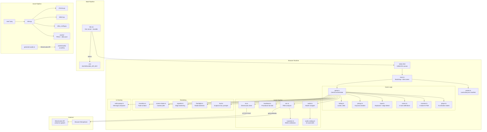
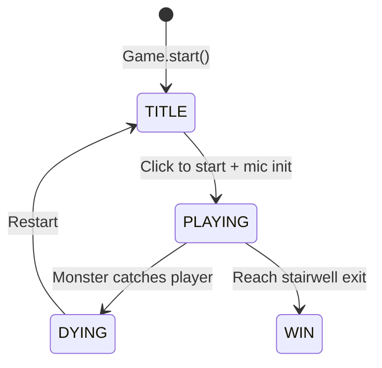
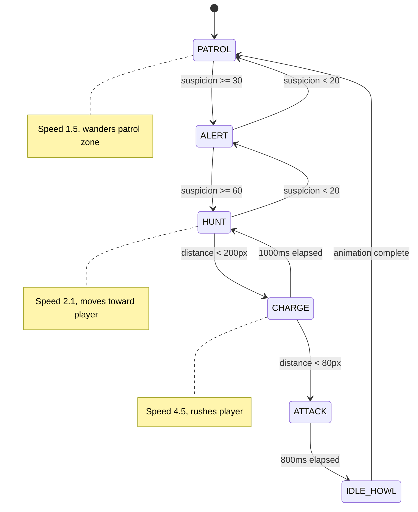
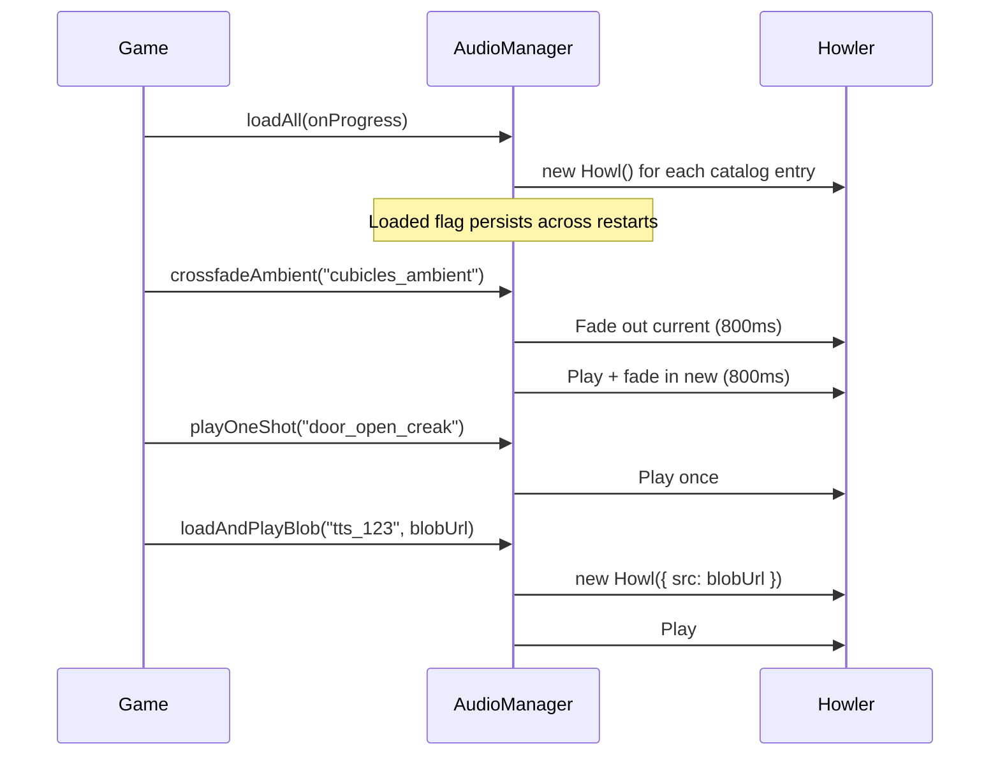
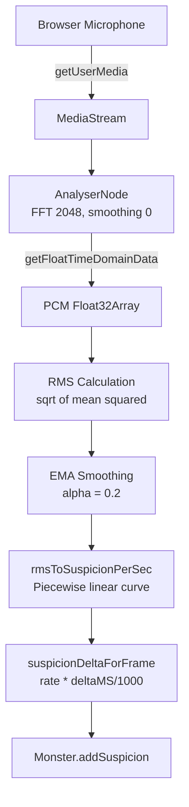
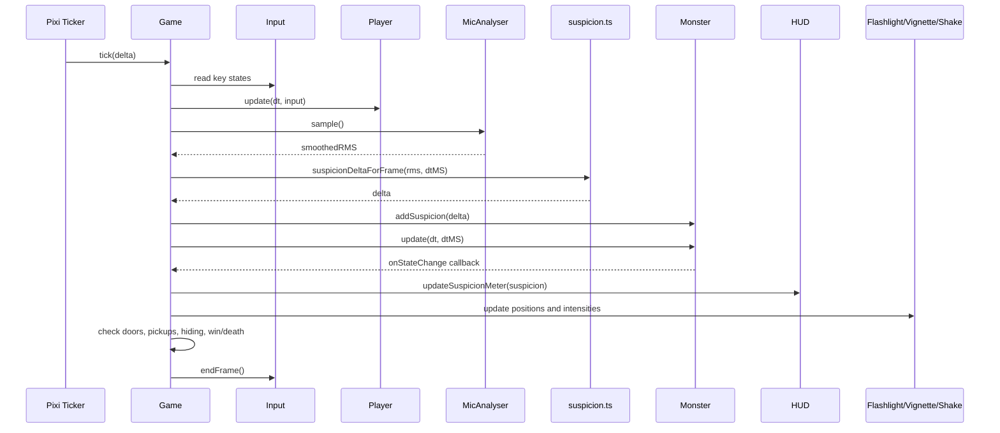
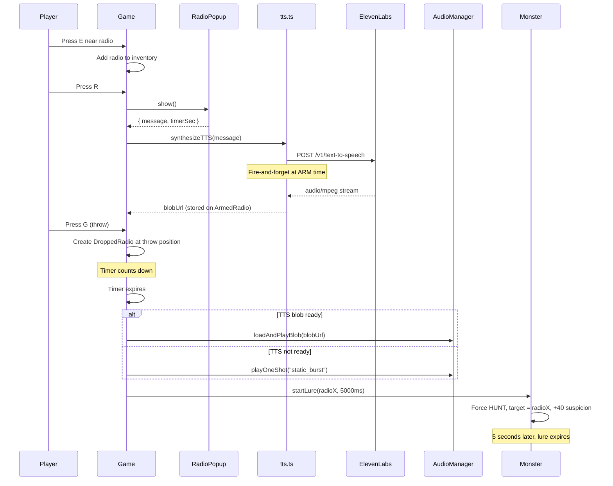

# Architecture

[Back to README](README.md)

## System Overview

Earshot is a browser-based 2D horror game with 23 TypeScript source files, 5 Python pipeline scripts, and 1 HTML entry point. The game runs on Pixi.js for rendering and Howler.js for audio. The player's real microphone feeds into a suspicion system that drives a 6-state monster AI.



## Directory Structure

```
Eleven labs/
  index.html               Game HTML shell (1280x720 viewport, overlays, radio popup form)
  package.json             v0.2.0, scripts: dev/build/slice/audio:generate
  vite.config.ts           Public dir: assets/, defines __ELEVENLABS_API_KEY__
  tsconfig.json            ES2020, strict disabled, bundler module resolution
  .env                     ELEVENLABS_API_KEY (not committed)
  src/
    main.ts                Bootstrap, title screen, ambient drone
    game.ts                Game loop, state machine, all subsystem coordination
    types.ts               GameState, RoomDefinition, MonsterState, etc.
    assets.ts              Manifest loader, texture registry
    input.ts               Key state tracking, edge detection
    player.ts              Sprite, 8 states, movement physics
    monster.ts             AI FSM, suspicion tracking, lure mechanics
    rooms.ts               ROOM_DEFINITIONS constant, RoomManager class
    room.ts                Background sprite container
    pickup.ts              Collectable item behavior
    hiding.ts              HidingSpot proximity and state
    audio.ts               AudioManager singleton (Howler wrapper)
    audio-catalog.ts       AUDIO_CATALOG constant (32 entries)
    mic.ts                 MicAnalyser singleton (Web Audio)
    suspicion.ts           rmsToSuspicionPerSec(), suspicionDeltaForFrame()
    tts.ts                 synthesizeTTS() (ElevenLabs POST)
    hud.ts                 HUD class (Pixi text overlays)
    flashlight.ts          Flashlight class (canvas radial gradient)
    vignette.ts            Vignette class (Pixi graphics)
    screen-shake.ts        ScreenShake class (random offset + decay)
    heartbeat.ts           Heartbeat class (Web Audio oscillators)
    radio-popup.ts         RadioPopup class (DOM modal)
    transition.ts          fadeTransition() async function
  scripts/
    slice.py               Pipeline orchestrator (~550 lines)
    atlas_config.py        ATLAS_PROFILES dict (18 entries)
    chroma.py              HSV chroma key, despill, feathering
    detect.py              CCL 8-connectivity, morphological closing
    generate-audio.ts      ElevenLabs audio asset generator CLI
    requirements.txt       Pillow, numpy, scipy
  assets/
    atlas.json             Generated sprite manifest
    audio/                 24 MP3 files
    player/                31 PNGs
    monster/               27 PNGs
    props/                 12 PNGs
    *.png                  Room backgrounds, title, gameover
    preview.html           Generated QA page for sprites
  docs/
    DAY2_GAMEPLAY.md       Gameplay skeleton dev journal
    DAY3_AUDIO.md          Audio integration dev journal
    DAY4_HIDING_AND_PROPS.md  Hiding + props dev journal
    DAY4_RADIO_BAIT.md     Radio bait dev journal
    DAY5_POLISH.md         Polish systems dev journal
  raw/                     Source art (gitignored)
```

## Component Details

### game.ts (Central Orchestrator)

The `Game` class owns every subsystem and runs the main loop via Pixi's ticker. It has 3 phases: TITLE, PLAYING, DYING.



During PLAYING, each tick:
1. Read keyboard input
2. Update player position and animation
3. Sample microphone RMS, compute suspicion delta
4. Update monster AI state machine
5. Check door proximity, pickup range, hiding spot range
6. Update HUD, flashlight, vignette, screen shake, heartbeat
7. Check win/death conditions

The Game class also manages:
- Room transitions (fade out, swap room, fade in)
- Radio lifecycle (pickup, arm, throw, detonate, lure)
- Death cinematic sequence (thud, monster loom, fade, stats screen)
- Audio coupling (monster state changes trigger vocal playback)

### monster.ts (AI State Machine)

The Monster runs a finite state machine with 6 states. Each state has an enter condition, behavior, and exit condition.



Key constants:
- `SUSPICION_MAX` = 100, `SUSPICION_DECAY_PER_SEC` = 5
- `SUSPICION_ALERT` = 30, `SUSPICION_HUNT` = 60, `SUSPICION_LOST` = 20
- `CHARGE_TRIGGER` = 200px, `ATTACK_TRIGGER` = 80px, `CATCH_DIST` = 80px
- `ALERT_WINDUP_MS` = 1500, `CHARGE_MAX_MS` = 1000, `ATTACK_DURATION_MS` = 800

The `startLure()` method is called when a radio bait detonates. It overrides the monster's hunt target to the radio's position for 5 seconds, forces HUNT state, and adds +40 suspicion. After the lure expires, normal player tracking resumes.

### player.ts (Player Character)

8 animation states, each with frame lists and movement speeds defined in `ANIM_DEFS`:

| State | Frames | Move Speed |
|-------|--------|------------|
| IDLE | idle (static) | 0 |
| WALK | walk1-4 | 2.5 px/frame |
| RUN | run1-4 | 5.0 px/frame |
| CROUCH_IDLE | crouch-idle1-2 | 0 |
| CROUCH_WALK | crouch-walk1-4 | 1.2 px/frame |
| HIDING_LOCKER | (hidden) | 0 |
| HIDING_DESK | (hidden) | 0 |
| CAUGHT | caught1-3 + death frames | 0 |

Movement is clamped to `[50, roomWidth - 50]`. The player's Y position is anchored to the room's `floorY` using each frame's `baselineY` value from the atlas manifest.

### rooms.ts (Room Definitions)

`ROOM_DEFINITIONS` is a constant that defines all 4 rooms with their full contents:

```mermaid
graph LR
    subgraph Reception
        R_DOOR[Door to Cubicles<br>press_e]
        R_PROPS[exit-sign, flickerlight]
    end

    subgraph Cubicles
        C_DOOR_L[Door to Reception<br>press_e]
        C_DOOR_R[Door to Server<br>press_e]
        C_ITEMS[Keycard pickup]
        C_HIDE[2 desks, 1 locker]
        C_RADIO[Radio on table]
    end

    subgraph Server
        S_DOOR_L[Door to Cubicles<br>press_e]
        S_DOOR_R[Door to Stairwell<br>breaker_on]
        S_ITEMS[Breaker switch]
        S_HIDE[2 lockers]
        S_RADIO[Radio on table]
    end

    subgraph Stairwell
        ST_DOOR_L[Door to Server<br>press_e]
        ST_EXIT[Exit door<br>requires keycard]
        ST_HIDE[1 desk]
    end

    Reception --> Cubicles
    Cubicles --> Server
    Server --> Stairwell
```



Each `RoomDefinition` contains:
- `bg`: background texture name
- `width`, `height`: room dimensions in pixels
- `monsterStart`: initial monster X position (null for reception)
- `monsterPatrolMin`, `monsterPatrolMax`: patrol bounds
- `doors[]`: position, target room, requirement (none, press_e, keycard, breaker_on)
- `pickups[]`: item definitions
- `hidingSpots[]`: locker/desk definitions with position and trigger width
- `decorativeProps[]`: visual-only props
- `radioPickups[]`: radio item definitions

### audio.ts (AudioManager)

The `AudioManager` is a singleton (`audioManager`) that wraps Howler.js. It survives game restarts, preventing audio interruption on death/restart.



Audio paths follow the pattern `/audio/{id}.mp3` where `id` matches the key in `AUDIO_CATALOG`.

### mic.ts + suspicion.ts (Microphone Pipeline)



The `MicAnalyser` connects to Howler's shared AudioContext (`Howler.ctx`) so there is only one audio context in the page. Microphone constraints disable all automatic processing (AGC, echo cancellation, noise suppression) to get raw RMS values.

The suspicion curve in `suspicion.ts` was calibrated against observed RMS values:
- Observed silence/idle: 0.0008 to 0.0021
- Silence floor set at 0.0025 (above max observed idle)
- Saturation at 120/sec (even shouting cannot exceed this)

### tts.ts (ElevenLabs Integration)

`synthesizeTTS(text, signal?)` makes a POST request to the ElevenLabs API:

- Endpoint: `https://api.elevenlabs.io/v1/text-to-speech/{VOICE_ID}`
- Voice: Adam (pNInz6obpgDQGcFmaJgB)
- Model: eleven_turbo_v2_5 (low latency)
- Voice settings: stability 0.4, similarity_boost 0.7, style 0.6
- Returns: Blob URL for Howler playback

The API key (`__ELEVENLABS_API_KEY__`) is injected by Vite's `define` at build time from `.env`. This means the key is in the client bundle. The code includes a security warning about this.

### flashlight.ts + vignette.ts (Atmosphere)

The flashlight renders a 3000x3000 canvas-based radial gradient that follows the player. Three modes:
- Normal: radius 280px, falloff 80px
- Locker: thin horizontal slit (louver effect), 95% opacity
- Desk: 70% scale (dimmer than normal)

The vignette is a Pixi Graphics overlay that darkens screen edges. Its target radius interpolates smoothly based on monster state:
- ATTACK: 0.30 (extreme tunnel vision)
- CHARGE: 0.45
- HUNT: 0.65
- ALERT or suspicion > 30: 0.85
- Default: 1.0 (no effect)

### heartbeat.ts (Procedural Audio)

Synthesizes a lub-dub heartbeat at runtime using two Web Audio oscillators (60Hz and 80Hz) with exponential decay envelopes.

| Suspicion | BPM | Volume |
|-----------|-----|--------|
| < 30 | Silent | 0 |
| 30 - 60 | 50 - 80 | 0.15 - 0.35 |
| 60 - 90 | 80 - 130 | 0.35 - 0.55 |
| > 90 | 130 - 160 | 0.55 - 0.80 |

## Data Flow: Full Game Tick



## Data Flow: Radio Bait Lifecycle



## State Management

All game state lives in a single `GameState` object created by `createInitialGameState()`:

```typescript
interface GameState {
  phase: GamePhase;           // "TITLE" | "PLAYING" | "DYING"
  currentRoom: RoomId;        // "reception" | "cubicles" | "server" | "stairwell"
  inventory: Set<PickupId>;   // "keycard" | "breaker_switch"
  breakerOn: boolean;
  suspicion: number;          // 0-100
  carriedRadio: ArmedRadio | null;
  droppedRadios: DroppedRadio[];
  spentRadios: SpentRadio[];
  isHiding: boolean;
  hidingKind: HidingSpotKind | null;
  runStats: { startTime, roomsVisited, monsterEncounters };
}
```

The `Game` class holds this state and mutates it directly. There is no state management library. The state is reset by calling `createInitialGameState()` on restart.

## Error Handling

- **Microphone denied/unavailable:** Game continues without mic input. Suspicion stays at 0.
- **TTS API failure:** Radio falls back to `static_burst` SFX. The radio still detonates and lures the monster.
- **Missing audio files:** Howler silently fails. The game continues without the sound.
- **Missing sprite frames:** The asset loader logs a warning. The game may show a blank sprite.

There is no global error boundary. Errors in the game loop will stop the ticker.

## Design Decisions

**Single-file orchestrator (game.ts).** All subsystem coordination happens in one file. This avoids event bus complexity at the cost of a large file. For a hackathon-scoped project, this tradeoff keeps the control flow readable.

**Singletons for audio and mic.** `audioManager` and `micAnalyser` persist across game restarts. This prevents re-requesting microphone permission and re-loading audio files on death/restart.

**DOM overlays for UI.** The radio popup and gameover stats use HTML/CSS rather than Pixi text. This simplifies text input handling and styling at the cost of mixing two rendering approaches.

**Client-side API key.** The ElevenLabs key is compiled into the bundle via Vite define. This is a known security tradeoff for hackathon speed. Production would need a backend proxy.

**Python asset pipeline.** The sprite slicer uses connected-component labeling (scipy) rather than fixed grid slicing. This handles hand-drawn art where frames have varying widths and occasional detached elements (fingers, weapons).

[Back to README](README.md)
