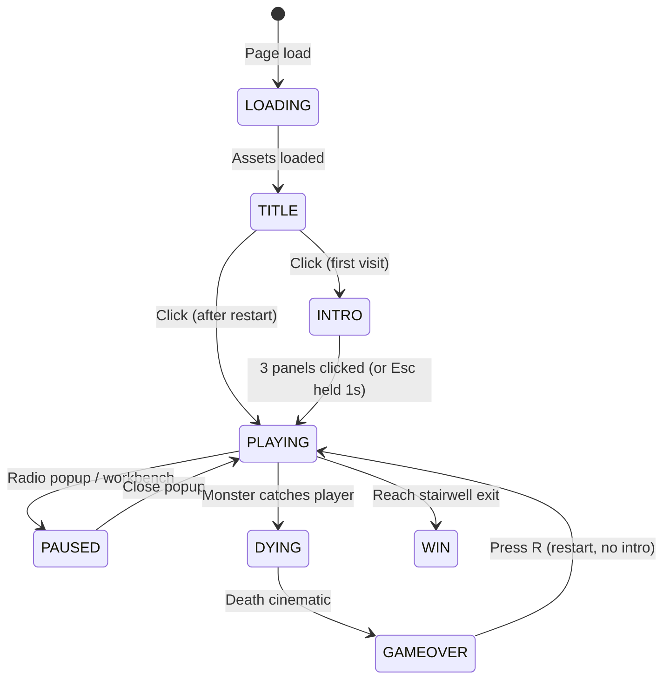
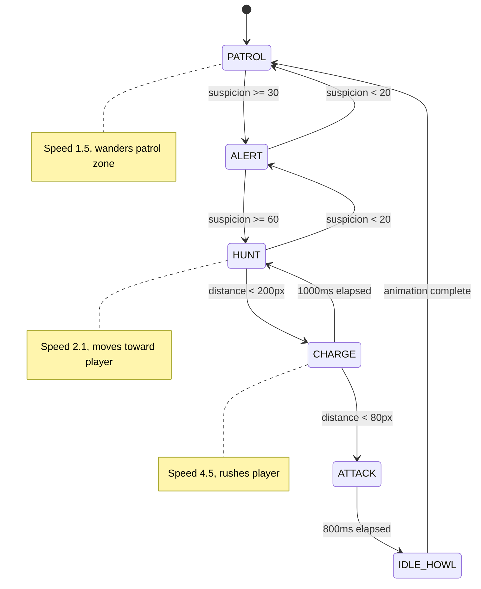
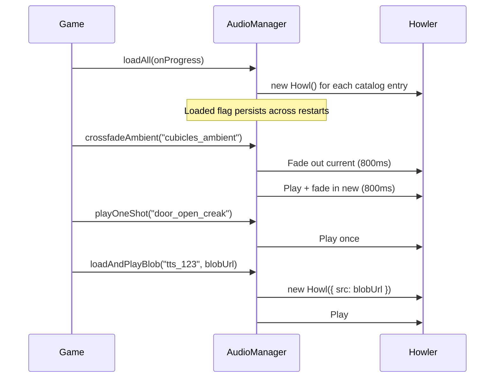
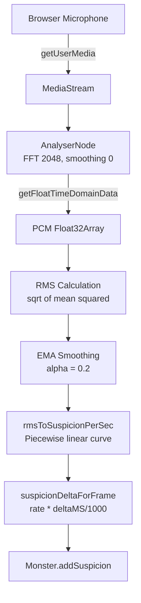
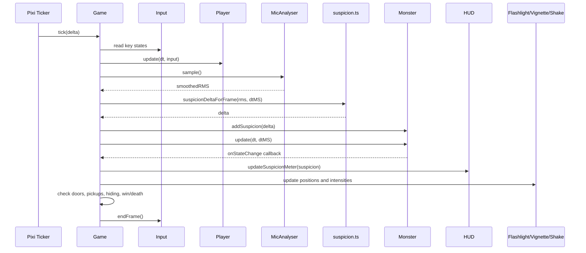
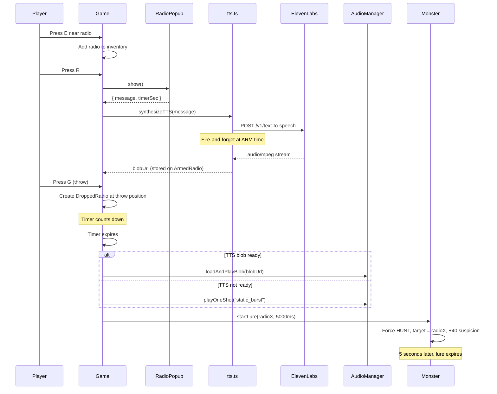

# Architecture

[Back to README](README.md)

## System Overview

Earshot is a browser-based 2D horror game with 34 TypeScript source files, 4 Python pipeline scripts, 1 TypeScript pipeline script, and 1 HTML entry point. The game runs on Pixi.js for rendering and Howler.js for audio. The player's real microphone feeds into a suspicion system that drives a 6-state monster AI.

```mermaid
graph TD
    subgraph "Browser Runtime"
        INDEX[index.html<br>1280x720 canvas] --> MAIN[main.ts<br>Bootstrap + title screen]
        MAIN --> ASSETS[assets.ts<br>Load atlas.json manifest]
        MAIN --> GAME[game.ts<br>Central orchestrator]

        subgraph "Game Logic"
            GAME --> PLAYER[player.ts<br>8 animation states]
            GAME --> MONSTER[monster.ts<br>6-state AI FSM]
            GAME --> JUMPER[jumper.ts<br>Ceiling ambush]
            GAME --> WHISPERER[whisperer.ts<br>Beacon drain ghost]
            GAME --> ROOMS_MGR[rooms.ts<br>5 room definitions]
            GAME --> INPUT[input.ts<br>Keyboard + edge detect]
            GAME --> PICKUP[pickup.ts<br>Keycard, breaker]
            GAME --> HIDING[hiding.ts<br>Locker, desk]
            GAME --> CRAFTING[crafting.ts<br>Recipes + inventory]
        end

        subgraph "Audio Pipeline"
            GAME --> AUDIO[audio.ts<br>Howler wrapper]
            AUDIO --> CATALOG[audio-catalog.ts<br>56 asset defs]
            GAME --> MIC[mic.ts<br>RMS analyser]
            MIC --> SUSPICION[suspicion.ts<br>RMS to delta/sec]
            GAME --> HEARTBEAT[heartbeat.ts<br>Procedural lub-dub]
            GAME --> TTS[tts.ts<br>ElevenLabs client]
        end

        subgraph "Rendering"
            GAME --> HUD[hud.ts<br>Beacon meter, prompts]
            HUD --> MINIMAP[minimap.ts<br>5-room parchment map]
            GAME --> FLASH[flashlight.ts<br>Radial darkness]
            GAME --> VIGNETTE[vignette.ts<br>Edge darkening]
            GAME --> SHAKE[screen-shake.ts<br>Camera jitter]
            GAME --> TRANSITION[transition.ts<br>Fade to black]
        end

        subgraph "UI Overlay"
            GAME --> RADIO_POPUP[radio-popup.ts<br>Message composer]
        end
    end

    subgraph "External"
        TTS -->|HTTPS POST| ELEVEN[ElevenLabs API<br>v1/text-to-speech]
        MIC -->|getUserMedia| BROWSER_MIC[Browser Microphone]
    end

    subgraph "Build Pipeline"
        VITE[Vite v6<br>Dev server + bundler] --> INDEX
        VITE --> ENV[.env<br>ELEVENLABS_API_KEY]
    end

    subgraph "Asset Pipeline"
        RAW[raw/*.png] --> SLICE[slice.py]
        SLICE --> CHROMA[chroma.py]
        SLICE --> DETECT[detect.py]
        SLICE --> CONFIG[atlas_config.py]
        SLICE --> ASSETS_DIR[assets/<br>PNGs + atlas.json]
        TTS -->|HTTPS POST| PROXY[api/tts.ts<br>Vercel serverless]
    PROXY -->|inject API key| ELEVEN
    GEN[generate-audio.ts] -->|ElevenLabs API| AUDIO_DIR[assets/audio/<br>56 MP3s]
    end
```



## Directory Structure

```
Eleven labs/
  index.html               Game HTML shell (1280x720 viewport, overlays, radio popup form)
  package.json             v0.2.0, scripts: dev/build/slice/audio:generate
  vite.config.ts           Public dir: assets/, strip-debug-assets plugin
  tsconfig.json            ES2020, strict disabled, bundler module resolution
  vercel.json              Vercel deployment config, cache headers
  .env                     ELEVENLABS_API_KEY (not committed)
  api/
    tts.ts                 Vercel serverless TTS proxy (POST-only, injects API key, 8s timeout)
  src/
    main.ts                Bootstrap, title screen, ambient drone
    game.ts                Game loop, state machine, all subsystem coordination
    types.ts               GameState, RoomDefinition, MonsterState, etc.
    assets.ts              Manifest loader, texture registry
    input.ts               Key state tracking, edge detection
    player.ts              Sprite, 8 states, movement physics
    monster.ts             AI FSM, suspicion tracking, lure mechanics
    jumper.ts              Ceiling ambush predator (5-state: dormant, triggered, falling, attacking, retreating)
    whisperer.ts           Psychological drain ghost (4-state: spawning, idle, fading, despawned)
    rooms.ts               ROOM_DEFINITIONS constant, RoomManager class
    room.ts                Background sprite container
    pickup.ts              Collectable item behavior
    hiding.ts              HidingSpot proximity and state
    crafting.ts            Crafting recipes and inventory management
    workbench-menu.ts      HTML overlay for crafting UI
    projectile.ts          Throwable item physics
    shade.ts               Death shade (inventory ghost)
    flare-effect.ts        Flare projectile with light radius
    smokebomb-effect.ts    Smoke bomb area effect
    decoy-effect.ts        Decoy radio broadcast effect
    audio.ts               AudioManager singleton (Howler wrapper)
    audio-catalog.ts       AUDIO_CATALOG constant (56 entries)
    mic.ts                 MicAnalyser singleton (Web Audio)
    suspicion.ts           rmsToSuspicionPerSec(), suspicionDeltaForFrame()
    tts.ts                 synthesizeTTS() (ElevenLabs POST)
    hud.ts                 HUD class (beacon meter, prompts, subtitles, inventory slots, hosts Minimap)
    minimap.ts             Minimap class (parchment sprites, 5-room layout, visited tracking, player dot pulse)
    flashlight.ts          Flashlight class (canvas radial gradient)
    vignette.ts            Vignette class (Pixi graphics)
    screen-shake.ts        ScreenShake class (random offset + decay)
    heartbeat.ts           Heartbeat class (Web Audio oscillators)
    radio-popup.ts         RadioPopup class (DOM modal)
    transition.ts          fadeTransition() async function
  scripts/
    slice.py               Pipeline orchestrator (~550 lines)
    atlas_config.py        ATLAS_PROFILES dict (53 entries)
    chroma.py              HSV chroma key, despill, feathering
    detect.py              CCL 8-connectivity, morphological closing
    generate-audio.ts      ElevenLabs audio asset generator CLI
    requirements.txt       Pillow, numpy, scipy
  assets/
    atlas.json             Generated sprite manifest
    audio/                 56 MP3 files
    player/                31 PNGs
    monster/               27 PNGs
    props/                 12 PNGs
    *.png                  Room backgrounds, title, gameover
    preview.html           Generated QA page for sprites
  docs/
    DAY2_GAMEPLAY.md       Gameplay skeleton dev journal
    DAY3_AUDIO.md          Audio integration dev journal
    DAY4_HIDING_AND_PROPS.md  Hiding + props dev journal
    DAY4_RADIO_BAIT.md     Radio bait dev journal
    DAY5_POLISH.md         Polish systems dev journal
  raw/                     Source art (gitignored)
```

## Component Details

### game.ts (Central Orchestrator)

The `Game` class owns every subsystem and runs the main loop via Pixi's ticker. Phases: INTRO, PLAYING, PAUSED, DYING, GAMEOVER, WIN.



During PLAYING, each tick:
1. Read keyboard input
2. Update player position and animation
3. Sample microphone RMS, compute suspicion delta
4. Update monster AI state machine
5. Check door proximity, pickup range, hiding spot range
6. Update HUD, flashlight, vignette, screen shake, heartbeat
7. Check win/death conditions

The Game class also manages:
- Room transitions (fade out, swap room, fade in)
- Radio lifecycle (pickup, arm, throw, detonate, lure)
- Death cinematic sequence (thud, monster loom, fade, stats screen)
- Audio coupling (monster state changes trigger vocal playback)

### monster.ts (AI State Machine)

The Monster runs a finite state machine with 6 states. Each state has an enter condition, behavior, and exit condition.



Key constants:
- `SUSPICION_MAX` = 100, `SUSPICION_DECAY_PER_SEC` = 5
- `SUSPICION_ALERT` = 30, `SUSPICION_HUNT` = 60, `SUSPICION_LOST` = 20
- `CHARGE_TRIGGER` = 200px, `ATTACK_TRIGGER` = 80px, `CATCH_DIST` = 80px
- `ALERT_WINDUP_MS` = 1500, `CHARGE_MAX_MS` = 1000, `ATTACK_DURATION_MS` = 800

The `startLure()` method is called when a radio bait detonates. It overrides the monster's hunt target to the radio's position for 5 seconds, forces HUNT state, and adds +40 suspicion. After the lure expires, normal player tracking resumes.

### player.ts (Player Character)

8 animation states, each with frame lists and movement speeds defined in `ANIM_DEFS`:

| State | Frames | Move Speed |
|-------|--------|------------|
| IDLE | idle (static) | 0 |
| WALK | walk1-4 | 2.5 px/frame |
| RUN | run1-4 | 5.0 px/frame |
| CROUCH_IDLE | crouch-idle1-2 | 0 |
| CROUCH_WALK | crouch-walk1-4 | 1.2 px/frame |
| HIDING_LOCKER | (hidden) | 0 |
| HIDING_DESK | (hidden) | 0 |
| CAUGHT | caught1-3 + death frames | 0 |

Movement is clamped to `[50, roomWidth - 50]`. The player's Y position is anchored to the room's `floorY` using each frame's `baselineY` value from the atlas manifest.

### rooms.ts (Room Definitions)

`ROOM_DEFINITIONS` is a constant that defines all 5 rooms with their full contents:

```mermaid
graph LR
    subgraph Reception
        R_DOOR[Doors to Cubicles,<br>Server, Archives]
        R_PROPS[exit-sign, flickerlight,<br>workbench]
    end

    subgraph Cubicles
        C_DOOR_L[Door to Reception<br>press_e]
        C_DOOR_R[Door to Server<br>press_e]
        C_ITEMS[Keycard pickup]
        C_HIDE[2 desks, 1 locker]
        C_RADIO[Radio on table]
        C_FG[7 foreground dividers<br>maze occlusion]
        C_VENT[Vent to Stairwell]
    end

    subgraph Server
        S_DOOR_L[Door to Cubicles<br>press_e]
        S_DOOR_R[Door to Stairwell<br>breaker_on]
        S_ITEMS[Breaker switch]
        S_HIDE[2 lockers]
        S_RADIO[Radio on table]
        S_UPPER[Upper floor<br>ladder x=1400]
    end

    subgraph Stairwell
        ST_DOOR_L[Door to Server<br>press_e]
        ST_EXIT[Exit door<br>requires keycard]
        ST_HIDE[1 desk]
        ST_VENT[Vent to Cubicles]
        ST_ALL[Listener+Jumper+<br>Whisperer 40%]
    end

    subgraph Archives
        A_DOOR[Door to Reception<br>press_e]
        A_ITEMS[Battery, map fragment,<br>lore tapes 04+05]
        A_HIDE[1 desk]
        A_WHISPERER[Whisperer 30%]
        A_DRAIN[Beacon drains 1.5x]
    end

    Reception --> Cubicles
    Reception --> Server
    Reception --> Archives
    Cubicles --> Server
    Server --> Stairwell
    Cubicles -.->|vent| Stairwell
```



Each `RoomDefinition` contains:
- `bg`: background texture name
- `width`, `height`: room dimensions in pixels
- `monsterStart`: initial monster X position (null for reception)
- `monsterPatrolMin`, `monsterPatrolMax`: patrol bounds
- `doors[]`: position, target room, requirement (none, press_e, keycard, breaker_on)
- `pickups[]`: item definitions
- `hidingSpots[]`: locker/desk definitions with position and trigger width
- `decorativeProps[]`: visual-only props (zIndex 0, rendered in room container)
- `foregroundProps[]`: props rendered ABOVE the player (zIndex 80 in world container). Used by Cubicles for maze dividers
- `radioPickups[]`: radio item definitions
- `upperBg`, `upperFloorY`, `upperFloorXMin`, `upperFloorXMax`, `ladders[]`: vertical traversal (Server room only). Player enters CLIMBING state via W/S near ladder x. Upper-bg is a Sprite positioned at `upperFloorXMin`; the catwalk walking surface is a TilingSprite of `traversal:catwalk` tiled across the upper floor width
- `whispererSpawnChance`: per-room override of Whisperer spawn probability (default 0.30, Stairwell uses 0.40)

#### Rendering layers (world container, sortableChildren=true)

| zIndex | Content |
|--------|---------|
| 0 | Room background, decorative props, door sprites |
| 5 | Upper floor background (Server) |
| 10 | Catwalk surface strip (TilingSprite, Server upper floor) |
| 30 | Ladder sprites |
| 50 | Player |
| 55 | Hatch sprite (above player at ladder top) |
| 80 | Foreground props (cubicle dividers) |

#### Stage-level layers (app.stage, sortableChildren=true)

| zIndex | Content |
|--------|---------|
| 100 | Flashlight canvas overlay |
| 150 | Vignette overlay |
| 5000 | HUD (suspicion meter, prompts) |
| 7000 | Intro panel container (3 panels, one visible at a time, each with a TTS voiceover narration via Adam voice) |
| 9500 | Loading screen (HTML, removed after boot) |
| 10000 | Fade transition overlay (temporary, during room changes) |

### audio.ts (AudioManager)

The `AudioManager` is a singleton (`audioManager`) that wraps Howler.js. It survives game restarts, preventing audio interruption on death/restart.



Audio paths follow the pattern `/audio/{id}.mp3` where `id` matches the key in `AUDIO_CATALOG`.

### mic.ts + suspicion.ts (Microphone Pipeline)



The `MicAnalyser` connects to Howler's shared AudioContext (`Howler.ctx`) so there is only one audio context in the page. Microphone constraints disable all automatic processing (AGC, echo cancellation, noise suppression) to get raw RMS values.

The suspicion curve in `suspicion.ts` was calibrated against observed RMS values:
- Observed silence/idle: 0.0008 to 0.0021
- Silence floor set at 0.01125 (calibration v2, +50% from 0.0075, above laptop mic idle noise)
- Saturation at 96/sec (calibration v2, 0.8x from 120, more forgiving overall)

### tts.ts (ElevenLabs Integration)

`synthesizeTTS(text, signal?, options?)` makes a POST request to the Vercel serverless proxy:

- Client endpoint: `POST /api/tts`
- Server proxy: `api/tts.ts` (Vercel serverless function)
- The proxy injects `ELEVENLABS_API_KEY` from `process.env` and forwards to `https://api.elevenlabs.io/v1/text-to-speech/{voice_id}`
- Default voice: Adam (`pNInz6obpgDQGcFmaJgB`)
- Allowed voices: Adam + Bella (`EXAVITQu4vr4xnSDxMaL`)
- Model: `eleven_turbo_v2_5` (low latency)
- Voice settings: stability 0.4, similarity_boost 0.7, style 0.6
- 8-second upstream timeout, 200 character text limit
- Returns: Blob URL for Howler playback

The API key never reaches the client bundle. It stays server-side in the Vercel environment.

### minimap.ts (Parchment Minimap)

The `Minimap` class renders a 5-room hub-and-spokes layout inside a parchment frame in the top-right corner of the HUD. It uses three atlas sprites from `assets/ui/`:

- `minimap-frame` (834x645 source, displayed at 240x180): parchment background with golden corners.
- `minimap-room-tile` (226x154 source, displayed at 36x26): one per room, tinted white (visited) or 0x666666 at 0.45 alpha (unvisited).
- `minimap-player-dot` (52x49 source, displayed at 14x14): pulsing white dot centered on the current room tile. Oscillates scale 1.0 to 1.15 over 1200ms via sin wave.

Room positions are normalized within the frame's inner area (directional insets measured per-edge from `minimap-frame.png` alpha, see `FRAME_INSET_*_PCT` constants in `src/minimap.ts`):

| Room | Position | Role |
|------|----------|------|
| Stairwell | (0.50, 0.18) | Top center |
| Cubicles | (0.20, 0.50) | Middle left |
| Server | (0.50, 0.50) | Hub (center) |
| Archives | (0.80, 0.50) | Middle right |
| Reception | (0.50, 0.85) | Bottom center |

Connection lines between adjacent rooms are drawn once at construction using Pixi Graphics (2px stroke, color 0x88684a). The vent shortcut (Cubicles to Stairwell) is not drawn.

Visibility is gated by `GameState.hasMapFragment`. The minimap fades in over 600ms when the Map Fragment is picked up in Archives. Map fragment pickup triggers TTS narration via the Phase 7 lore tape pipeline (`tape_map_fragment` catalog entry, Adam voice, subtitle computed from Howl duration + 500ms tail).

**Map fragment lifecycle.** The map fragment is classified as a quest item, distinct from inventory materials. It persists through death by design (Phase 9D Issue 2, decision A). The minimap, gated by `hasMapFragment`, remains visible across deaths. Death costs time and inventory, but not knowledge.

**Visited room persistence.** The minimap's `visitedRooms` set persists across deaths and only resets on full game restart (Phase 9D Issue 4, decision A). On full game restart (new Game instance), all state resets.

Visited rooms are tracked via `Set<RoomId>`, updated every frame by `onRoomEnter()` (called from `HUD.updateMinimap()`). This tracks room visits even before the minimap becomes visible, so when the player picks up the map fragment, all previously visited rooms are already marked. Server upper floor does not affect the minimap; the player dot stays on the Server tile regardless of floor.

### flashlight.ts + vignette.ts (Atmosphere)

The flashlight renders a 3000x3000 canvas-based radial gradient that follows the player. Three modes:
- Normal: radius 280px, falloff 80px
- Locker: thin horizontal slit (louver effect), 95% opacity
- Desk: 70% scale (dimmer than normal)

The vignette is a Pixi Graphics overlay that darkens screen edges. Its target radius interpolates smoothly based on monster state:
- ATTACK: 0.30 (extreme tunnel vision)
- CHARGE: 0.45
- HUNT: 0.65
- ALERT or suspicion > 30: 0.85
- Default: 1.0 (no effect)

### heartbeat.ts (Procedural Audio)

Synthesizes a lub-dub heartbeat at runtime using two Web Audio oscillators (60Hz and 80Hz) with exponential decay envelopes.

| Suspicion | BPM | Volume |
|-----------|-----|--------|
| < 30 | Silent | 0 |
| 30 - 60 | 50 - 80 | 0.15 - 0.35 |
| 60 - 90 | 80 - 130 | 0.35 - 0.55 |
| > 90 | 130 - 160 | 0.55 - 0.80 |

## Data Flow: Full Game Tick



## Data Flow: Radio Bait Lifecycle



## State Management

All game state lives in a single `GameState` object created by `createInitialGameState()`:

```typescript
interface GameState {
  phase: GamePhase;           // "INTRO" | "PLAYING" | "PAUSED" | "DYING" | "GAMEOVER" | "WIN"
  introPanelIndex: 0 | 1 | 2;
  currentRoom: RoomId;        // "reception" | "cubicles" | "server" | "stairwell" | "archives"
  inventory: Set<PickupId>;   // "keycard" | "breaker_switch"
  breakerOn: boolean;
  suspicion: number;          // 0-100
  carriedRadio: ArmedRadio | null;
  droppedRadios: DroppedRadio[];
  spentRadios: SpentRadio[];
  isHiding: boolean;
  hidingKind: HidingSpotKind | null;
  runStats: { startTime, roomsVisited, monsterEncounters };
}
```

The `Game` class holds this state and mutates it directly. There is no state management library. The state is reset by calling `createInitialGameState()` on restart.

## Error Handling

- **Microphone denied/unavailable:** Game continues without mic input. Suspicion stays at 0.
- **TTS API failure:** Radio falls back to `static_burst` SFX. The radio still detonates and lures the monster.
- **Missing audio files:** Howler silently fails. The game continues without the sound.
- **Missing sprite frames:** The asset loader logs a warning. The game may show a blank sprite.

There is no global error boundary. Errors in the game loop will stop the ticker.

## Design Decisions

**Single-file orchestrator (game.ts).** All subsystem coordination happens in one file. This avoids event bus complexity at the cost of a large file. For a hackathon-scoped project, this tradeoff keeps the control flow readable.

**Singletons for audio and mic.** `audioManager` and `micAnalyser` persist across game restarts. This prevents re-requesting microphone permission and re-loading audio files on death/restart.

**DOM overlays for UI.** The radio popup and gameover stats use HTML/CSS rather than Pixi text. This simplifies text input handling and styling at the cost of mixing two rendering approaches.

**Server-side API key.** The ElevenLabs key is held server-side in a Vercel serverless function (`api/tts.ts`). The client calls `/api/tts`, the proxy injects the key and forwards to ElevenLabs. The key never appears in the client bundle.

**Python asset pipeline.** The sprite slicer uses connected-component labeling (scipy) rather than fixed grid slicing. This handles hand-drawn art where frames have varying widths and occasional detached elements (fingers, weapons).

[Back to README](README.md)
