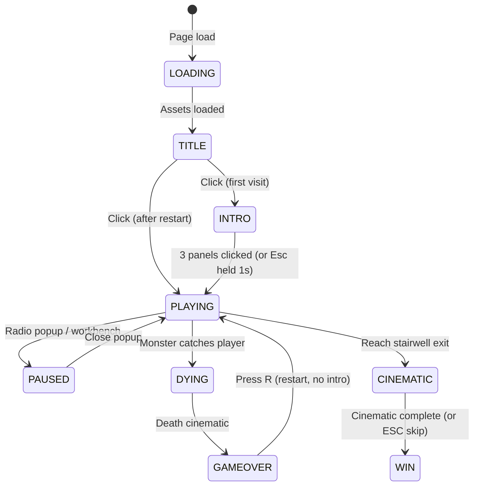
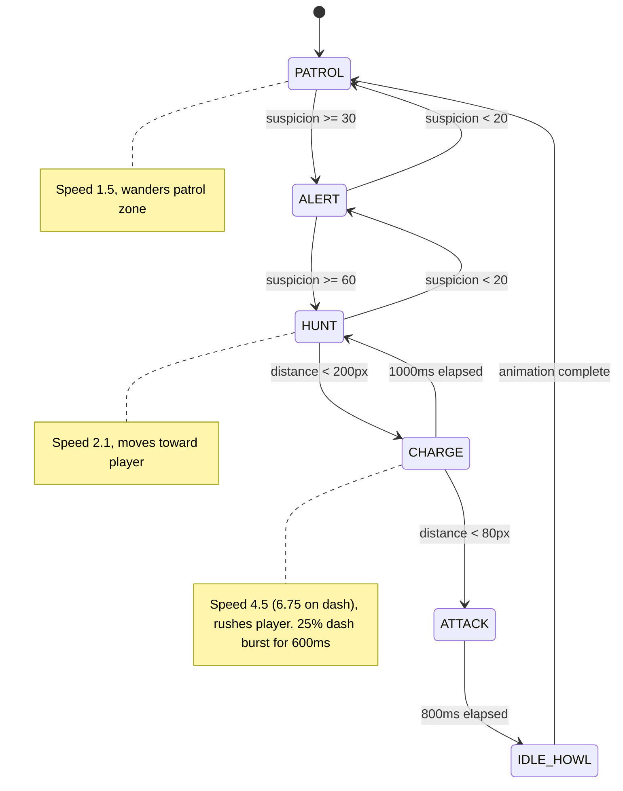
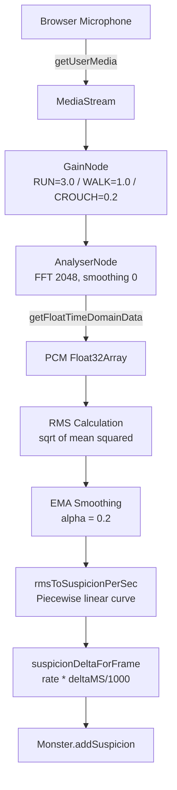

# Architecture

[Back to README](README.md)

## System Overview

Earshot is a browser-based 2D horror game with 36 TypeScript source files, 4 Python pipeline scripts, 1 TypeScript pipeline script, and 1 HTML entry point. The game runs on Pixi.js for rendering and Howler.js for audio. The player's real microphone feeds through a GainNode (modulated by movement state) into a suspicion system that drives a 6-state monster AI.

```mermaid
graph TD
    subgraph "Browser Runtime"
        INDEX[index.html<br>1280x720 canvas] --> MAIN[main.ts<br>Bootstrap + title screen]
        MAIN --> ASSETS[assets.ts<br>Load atlas.json manifest]
        MAIN --> GAME[game.ts<br>Central orchestrator]

        subgraph "Game Logic"
            GAME --> PLAYER[player.ts<br>13 animation states]
            GAME --> MONSTER[monster.ts<br>6-state AI FSM]
            GAME --> JUMPER[jumper.ts<br>Ceiling+floor ambush]
            GAME --> WHISPERER[whisperer.ts<br>Beacon drain ghost]
            GAME --> ROOMS_MGR[rooms.ts<br>5 room definitions]
            GAME --> INPUT[input.ts<br>Keyboard + edge detect]
            GAME --> PICKUP[pickup.ts<br>Keycard, breaker]
            GAME --> HIDING[hiding.ts<br>Locker, desk]
            GAME --> TAPE_PUZZLE[tape-puzzle.ts<br>Tape reconstruction]
        end

        subgraph "Audio Pipeline"
            GAME --> AUDIO[audio.ts<br>Howler wrapper]
            AUDIO --> CATALOG[audio-catalog.ts<br>86 catalog entries]
            GAME --> MIC[mic.ts<br>RMS analyser]
            MIC --> SUSPICION[suspicion.ts<br>RMS to delta/sec]
            GAME --> HEARTBEAT[heartbeat.ts<br>Procedural lub-dub]
            GAME --> TTS[tts.ts<br>ElevenLabs client]
        end

        subgraph "Rendering"
            GAME --> HUD[hud.ts<br>Beacon meter, prompts]
            HUD --> MINIMAP[minimap.ts<br>5-room parchment map]
            GAME --> FLASH[flashlight.ts<br>Radial darkness]
            GAME --> VIGNETTE[vignette.ts<br>Edge darkening]
            GAME --> SHAKE[screen-shake.ts<br>Camera jitter]
            GAME --> TRANSITION[transition.ts<br>Fade to black]
            GAME --> GARROW[guidance-arrow.ts<br>Objective arrow]
        end

        subgraph "UI Overlay"
            GAME --> RADIO_POPUP[radio-popup.ts<br>Message composer]
        end
    end

    subgraph "External"
        TTS -->|HTTPS POST| ELEVEN[ElevenLabs API<br>v1/text-to-speech]
        MIC -->|getUserMedia| BROWSER_MIC[Browser Microphone]
    end

    subgraph "Build Pipeline"
        VITE[Vite v6<br>Dev server + bundler] --> INDEX
        VITE --> ENV[.env<br>ELEVENLABS_API_KEY]
    end

    subgraph "Asset Pipeline"
        RAW[raw/*.png] --> SLICE[slice.py]
        SLICE --> CHROMA[chroma.py]
        SLICE --> DETECT[detect.py]
        SLICE --> CONFIG[atlas_config.py]
        SLICE --> ASSETS_DIR[assets/<br>PNGs + atlas.json]
        TTS -->|HTTPS POST| PROXY[api/tts.ts<br>Vercel serverless]
    PROXY -->|inject API key| ELEVEN
    GEN[generate-audio.ts] -->|ElevenLabs API| AUDIO_DIR[assets/audio/<br>86 MP3s]
    end
```



## Directory Structure

```
Eleven labs/
  index.html               Game HTML shell (1280x720 viewport, overlays, radio popup form)
  package.json             v0.2.0, scripts: dev/build/slice/audio:generate
  vite.config.ts           Public dir: assets/, strip-debug-assets plugin
  tsconfig.json            ES2020, strict disabled, bundler module resolution
  vercel.json              Vercel deployment config, cache headers
  .env                     ELEVENLABS_API_KEY (not committed)
  api/
    tts.ts                 Vercel serverless TTS proxy (POST-only, injects API key, 8s timeout)
  src/
    main.ts                Bootstrap, title screen, ambient drone
    game.ts                Game loop, state machine, all subsystem coordination
    types.ts               GameState, RoomDefinition, MonsterState, etc.
    assets.ts              Manifest loader, texture registry
    input.ts               Key state tracking, edge detection
    player.ts              Sprite, 13 states, movement physics
    monster.ts             AI FSM, suspicion tracking, lure mechanics
    jumper.ts              Ceiling and floor ambush predator (10-state, per-variant frame prefix maps to avoid baked-vent artifacts on floor)
    whisperer.ts           Psychological drain ghost (4-state: spawning, idle, fading, despawned)
    rooms.ts               ROOM_DEFINITIONS constant, RoomManager class
    room.ts                Background sprite container
    pickup.ts              Collectable item behavior
    hiding.ts              HidingSpot proximity and state
    tape-puzzle.ts         Tape reconstruction puzzle (click-to-place reorder UI)
    crafting.ts            (dormant) Crafting recipes, removed in Hotfix Q
    workbench-menu.ts      (dormant) HTML overlay for crafting UI
    projectile.ts          Throwable item physics
    shade.ts               Death shade (inventory ghost)
    flare-effect.ts        Flare projectile with light radius
    smokebomb-effect.ts    Smoke bomb area effect
    decoy-effect.ts        Decoy radio broadcast effect
    audio.ts               AudioManager singleton (Howler wrapper)
    audio-catalog.ts       AUDIO_CATALOG constant (86 entries)
    mic.ts                 MicAnalyser singleton (Web Audio)
    suspicion.ts           rmsToSuspicionPerSec(), suspicionDeltaForFrame()
    tts.ts                 synthesizeTTS() (ElevenLabs POST)
    hud.ts                 HUD class (beacon meter, sprite/text prompts, subtitles, inventory slots, hosts Minimap)
    minimap.ts             Minimap class (parchment sprites, 5-room layout, visited tracking, player dot pulse)
    flashlight.ts          Flashlight class (canvas radial gradient)
    vignette.ts            Vignette class (Pixi graphics)
    screen-shake.ts        ScreenShake class (random offset + decay)
    heartbeat.ts           Heartbeat class (Web Audio oscillators)
    radio-popup.ts         RadioPopup class (DOM modal)
    guidance-arrow.ts      GuidanceArrow class (floating objective pointer above player head)
    transition.ts          fadeTransition() async function
  scripts/
    slice.py               Pipeline orchestrator (~550 lines)
    atlas_config.py        ATLAS_PROFILES dict (73 entries)
    chroma.py              HSV chroma key, despill, feathering
    detect.py              CCL 8-connectivity, morphological closing
    generate-audio.ts      ElevenLabs audio asset generator CLI
    requirements.txt       Pillow, numpy, scipy
  assets/
    atlas.json             Generated sprite manifest
    audio/                 86 MP3 files
    player/                49 PNGs
    monster/               27 PNGs
    props/                 12 PNGs
    *.png                  Room backgrounds, title, gameover
    preview.html           Generated QA page for sprites
  docs/
    CHANGELOG.md           Consolidated hotfix log (41 entries)
    fixes/                 Individual hotfix reports (deep history)
    journal/               Day-by-day build logs (DAY2 through DAY5)
    audits/                Asset usage audit, documentation cleanup report
  raw/                     Source art (gitignored)
```

## Component Details

### game.ts (Central Orchestrator)

The `Game` class owns every subsystem and runs the main loop via Pixi's ticker. Phases: INTRO, PLAYING, PAUSED, DYING, GAMEOVER, CINEMATIC, WIN.



During PLAYING, each tick:
1. Read keyboard input
2. Update player position and animation
3. Sample microphone RMS, compute suspicion delta
4. Update monster AI state machine
5. Check door proximity, pickup range, hiding spot range
6. Update HUD, flashlight, vignette, screen shake, heartbeat
7. Check win/death conditions

The Game class also manages:
- Room transitions (fade out, swap room, fade in)
- Radio lifecycle (pickup, arm, throw, detonate, lure)
- Death cinematic sequence (thud, monster loom, fade, stats screen)
- Audio coupling (monster state changes trigger vocal playback)

### monster.ts (AI State Machine)

The Monster runs a finite state machine with 6 states. Each state has an enter condition, behavior, and exit condition.



Key constants:
- `SUSPICION_MAX` = 100, `SUSPICION_DECAY_PER_SEC` = 5
- `SUSPICION_ALERT` = 30, `SUSPICION_HUNT` = 60, `SUSPICION_LOST` = 20
- `CHARGE_TRIGGER` = 200px, `ATTACK_TRIGGER` = 80px, `CATCH_DIST` = 80px
- `ALERT_WINDUP_MS` = 1500, `CHARGE_MAX_MS` = 1000, `ATTACK_DURATION_MS` = 800
- `DASH_PROBABILITY` = 0.25, `DASH_SPEED_MULT` = 1.5, `DASH_DURATION_MS` = 600

The `startLure()` method is called when a radio bait detonates. It overrides the monster's hunt target to the radio's position for 5 seconds, forces HUNT state, and adds +40 suspicion. After the lure expires, normal player tracking resumes.

### player.ts (Player Character)

13 animation states defined in `ANIM_DEFS`. Priority order (highest first): hiding/caught (state-locked), crouch (CTRL), run (SHIFT), scared (monster nearby or beacon < 30%), walk/idle (baseline).

| State | Frames | Move Speed | Notes |
|-------|--------|------------|-------|
| IDLE | idle | 0 | |
| WALK | walk1-4 | 3 | |
| SCARED_IDLE | scared-idle1-2 | 0 | 2-frame breathing loop |
| SCARED_WALK | walk1-4 | 3 | Periodic look-back interrupt every 3-4.5s |
| RUN | run1-4 | 6 | Mic gain 3x via GainNode |
| RUN_STOP | run-stop | 0 | 200ms deceleration after exiting RUN |
| CROUCH_IDLE | crouch-idle1-2 | 0 | Mic gain 0.2x |
| CROUCH_WALK | crouch-walk1-4 | 1.5 | Mic gain 0.2x |
| HIDING_LOCKER | locker-hide | 0 | Suspicion drops to 0 |
| HIDING_DESK_ENTERING | hide-desk-enter1-6 | 0 | loop: false, auto-transitions to IDLE |
| HIDING_DESK_IDLE | hide-desk-idle1-6 | 0 | 4x suspicion decay |
| HIDING_DESK_EXITING | hide-desk-exit1-6 | 0 | loop: false, auto-transitions to IDLE |
| CAUGHT | caught1-3, dead-collapsed | 0 | loop: false |

Movement is clamped to `[50, roomWidth - 50]`. Y position is anchored via each frame's `baselineY` from the atlas manifest.

### rooms.ts (Room Definitions)

`ROOM_DEFINITIONS` defines all 5 rooms. Reception is the hub. The exit in Stairwell requires both keycard and active breaker.

| Room | Size | Monsters | Key Items |
|------|------|----------|-----------|
| Reception | 2896x1086 | None | Tape station (workbench), lore tape 01 |
| Cubicles | 3344x941 | Listener, Jumpers | Keycard, broken tape 01, radio. 7 foreground dividers, vent to Stairwell |
| Server | 3344x941 | Listener, Jumpers | Breaker switch, broken tape 02, radio. Upper floor with ladder |
| Stairwell | 3344x941 | Listener, Jumpers, Whisperer (40%) | Broken tape 03, vent to Cubicles. EXIT requires keycard + breaker |
| Archives | 2044x769 | Whisperer (30%) | Map fragment, whisper trapdoor. Beacon drains 1.5x faster |

Each `RoomDefinition` contains: `bg`, `width/height`, `doors[]` (with requirements: press_e, keycard, breaker_on), `pickups[]`, `hidingSpots[]`, `decorativeProps[]`, `foregroundProps[]`, `radioPickups[]`, and optional vertical traversal fields for Server's upper floor.

#### Rendering layers

World container uses `sortableChildren=true`. Key layers: room background (0), jumper peeking (15), player (50), guidance arrow (55), foreground props (80), jumper active states (90). Stage-level: flashlight (100), vignette (150), HUD (5000), intro panels (7000), fade overlay (10000).

### audio.ts (AudioManager)

Singleton (`audioManager`) wrapping Howler.js. Persists across game restarts to avoid re-loading 86 audio files. Key methods: `crossfadeAmbient()` (800ms crossfade between room tracks), `playOneShot()` (fire-and-forget SFX), `loadAndPlayBlob()` (runtime TTS playback). Audio paths: `/audio/{id}.mp3` matching keys in `AUDIO_CATALOG`.

### mic.ts + suspicion.ts (Microphone Pipeline)



The `MicAnalyser` connects to Howler's shared AudioContext (`Howler.ctx`). A GainNode inserted between the MediaStreamSource and AnalyserNode is modulated per frame by game.ts based on player movement state: 3.0 when running (SHIFT), 0.2 when crouching (CTRL), 1.0 otherwise. Microphone constraints disable AGC, echo cancellation, and noise suppression.

Silence floor: 0.01125 RMS. Saturation: 96/sec.

### tts.ts (ElevenLabs Integration)

`synthesizeTTS(text, signal?, options?)` makes a POST request to the Vercel serverless proxy:

- Client endpoint: `POST /api/tts`
- Server proxy: `api/tts.ts` (Vercel serverless function)
- The proxy injects `ELEVENLABS_API_KEY` from `process.env` and forwards to `https://api.elevenlabs.io/v1/text-to-speech/{voice_id}`
- Default voice: Adam (`pNInz6obpgDQGcFmaJgB`)
- Allowed voices: Adam + Bella (`EXAVITQu4vr4xnSDxMaL`)
- Model: `eleven_turbo_v2_5` (low latency)
- Voice settings: stability 0.4, similarity_boost 0.7, style 0.6
- 8-second upstream timeout, 200 character text limit
- Returns: Blob URL for Howler playback

The API key never reaches the client bundle. It stays server-side in the Vercel environment.

### minimap.ts (Parchment Minimap)

Renders a 5-room hub-and-spokes layout in the top-right HUD corner using Pixi Graphics primitives. Hidden until the player picks up the map fragment in Archives (fades in over 600ms). Room tiles are tinted white (visited) or grey (unvisited). A pulsing dot marks the current room. Completing tape 1 enables threat markers (colored dots on rooms with monsters).

Both `hasMapFragment` and `visitedRooms` persist through death. The map fragment is a quest item, not lost on death. Visited rooms reset only on full game restart.

### flashlight.ts + vignette.ts (Atmosphere)

The flashlight renders a 3000x3000 canvas-based radial gradient that follows the player. Three modes:
- Normal: radius 280px, falloff 80px
- Locker: thin horizontal slit (louver effect), 95% opacity
- Desk: 70% scale (dimmer than normal)

The vignette is a Pixi Graphics overlay that darkens screen edges. Its target radius interpolates smoothly based on monster state:
- ATTACK: 0.30 (extreme tunnel vision)
- CHARGE: 0.45
- HUNT: 0.65
- ALERT or suspicion > 30: 0.85
- Default: 1.0 (no effect)

### heartbeat.ts (Procedural Audio)

Synthesizes a lub-dub heartbeat at runtime using two Web Audio oscillators (60Hz and 80Hz) with exponential decay envelopes.

| Suspicion | BPM | Volume |
|-----------|-----|--------|
| < 30 | Silent | 0 |
| 30 - 60 | 50 - 80 | 0.15 - 0.35 |
| 60 - 90 | 80 - 130 | 0.35 - 0.55 |
| > 90 | 130 - 160 | 0.55 - 0.80 |

## Data Flow: Full Game Tick

Each PLAYING tick: read input, update player (with scared flag), set mic GainNode based on movement state, sample mic RMS, compute suspicion delta, update monster AI, update HUD/flashlight/vignette/shake/heartbeat, check doors/pickups/hiding/win/death, end frame.

## Data Flow: Radio Bait Lifecycle

Pick up a radio (E), open the popup (R), type a message, arm with a 3-5s timer. The TTS request fires at arm time (fire-and-forget). Throw (G). When the timer expires, the TTS audio plays at the throw position (or `static_burst` SFX if the API hasn't returned). The Listener is lured to the radio for 5 seconds with +40 suspicion and forced HUNT state.

## State Management

All game state lives in a single `GameState` object created by `createInitialGameState()`:

```typescript
interface GameState {
  phase: GamePhase;           // "INTRO" | "PLAYING" | "PAUSED" | "DYING" | "GAMEOVER" | "CINEMATIC" | "WIN"
  introPanelIndex: 0 | 1 | 2;
  currentRoom: RoomId;        // "reception" | "cubicles" | "server" | "stairwell" | "archives"
  inventory: Set<PickupId>;   // "keycard" | "breaker_switch" | TapeId
  breakerOn: boolean;
  suspicion: number;          // 0-100
  carriedRadio: ArmedRadio | null;
  droppedRadios: DroppedRadio[];
  spentRadios: SpentRadio[];
  isHiding: boolean;
  hidingKind: HidingSpotKind | null;
  brokenTapesCollected: Set<TapeId>;
  tapesReconstructed: Set<TapeId>;
  revealMonsterPositions: boolean;
  exitFinalChallengeActive: boolean;
  runStats: { startTime, roomsVisited, monsterEncounters };
}
```

The `Game` class holds this state and mutates it directly. There is no state management library. The state is reset by calling `createInitialGameState()` on restart.

## Error Handling

- **Microphone denied/unavailable:** Game continues without mic input. Suspicion stays at 0.
- **TTS API failure:** Radio falls back to `static_burst` SFX. The radio still detonates and lures the monster.
- **Missing audio files:** Howler silently fails. The game continues without the sound.
- **Missing sprite frames:** The asset loader logs a warning. The game may show a blank sprite.

There is no global error boundary. Errors in the game loop will stop the ticker.

## Design Decisions

**Single-file orchestrator (game.ts).** All subsystem coordination happens in one file. This avoids event bus complexity at the cost of a large file. For a hackathon-scoped project, this tradeoff keeps the control flow readable.

**Singletons for audio and mic.** `audioManager` and `micAnalyser` persist across game restarts. This prevents re-requesting microphone permission and re-loading audio files on death/restart.

**DOM overlays for UI.** The radio popup and gameover stats use HTML/CSS rather than Pixi text. This simplifies text input handling and styling at the cost of mixing two rendering approaches.

**Server-side API key.** The ElevenLabs key is held server-side in a Vercel serverless function (`api/tts.ts`). The client calls `/api/tts`, the proxy injects the key and forwards to ElevenLabs. The key never appears in the client bundle.

**Python asset pipeline.** The sprite slicer uses connected-component labeling (scipy) rather than fixed grid slicing. This handles hand-drawn art where frames have varying widths and occasional detached elements (fingers, weapons).

**Tape reconstruction over crafting.** The original crafting system (collect materials, combine at workbench) was removed in Hotfix Q. The workbench was repurposed as a tape reconstruction station in Hotfix T. Three broken tapes are scattered across rooms. Each tape has four audio segments that must be reordered by ear. Correct reconstruction unlocks rewards: minimap threat markers (tape 1), a deferred flag (tape 2), and a silent exit challenge (tape 3).
