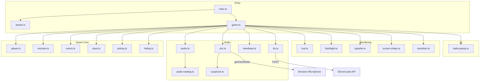
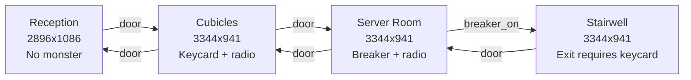
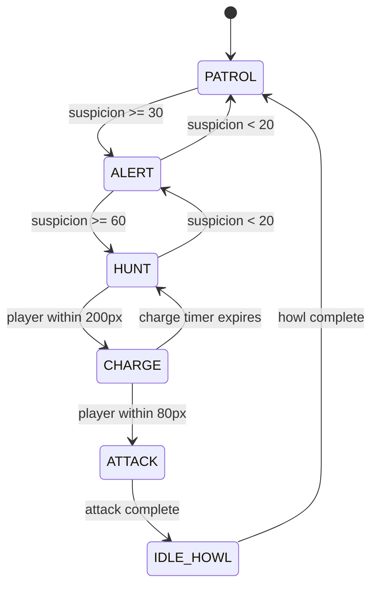
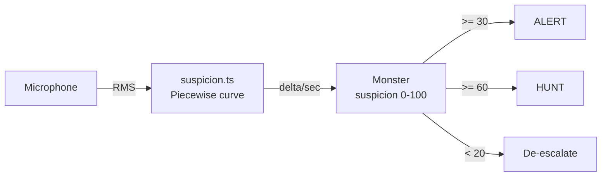
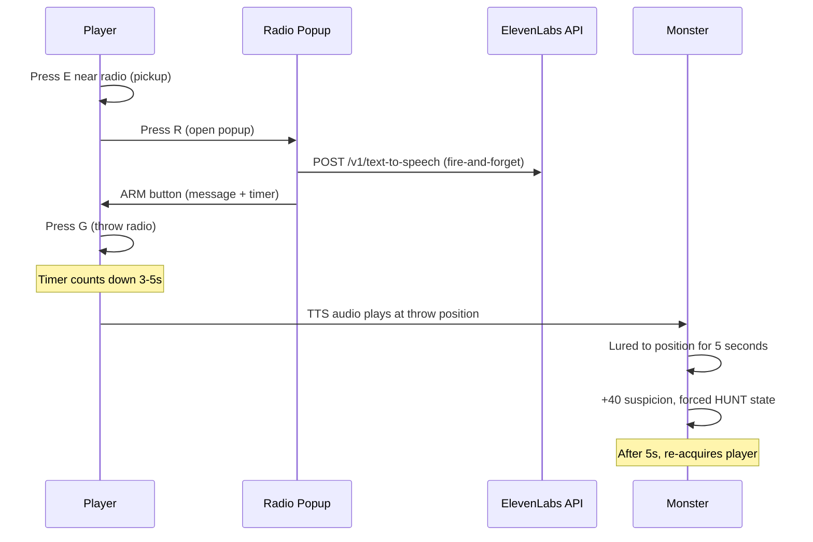
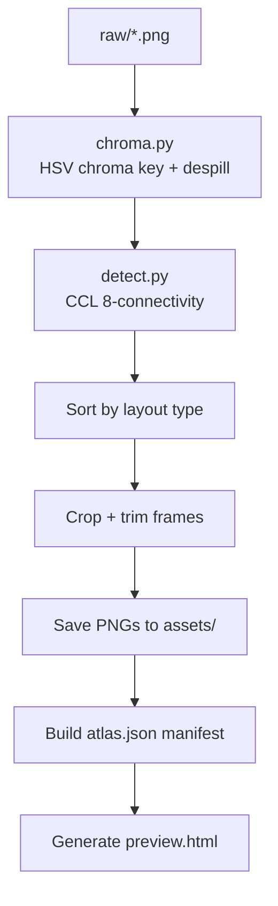

# Earshot

A 2D side-scrolling horror game where the monster hunts by sound. Your real microphone feeds into the game: speak, cough, or breathe too loud and the creature finds you. Distract it by arming portable radios with custom text-to-speech messages via the ElevenLabs API.

Built with Pixi.js and Howler.js. Hand-drawn pixel art processed through a custom Python atlas pipeline.

## Quick Start

```bash
# Install dependencies
npm install
pip install -r scripts/requirements.txt

# Set your ElevenLabs API key
echo "ELEVENLABS_API_KEY=sk-your-key-here" > .env

# Generate audio assets (requires ElevenLabs API key)
npm run audio:generate

# Slice sprite atlases from raw art (if you have raw/ PNGs)
npm run slice

# Start dev server
npm run dev
```

Open `http://localhost:5173`. Click to start. Allow microphone access when prompted.

## Controls

| Key | Action |
|-----|--------|
| A/D or Arrow Left/Right | Move |
| Shift (hold) | Run |
| Ctrl (hold) | Crouch |
| E | Interact (doors, pickups, hiding spots) |
| R | Arm carried radio (opens popup) |
| G | Throw armed radio |

## What It Does

The game drops the player into a 4-room abandoned office building. The objective: find a keycard, activate a breaker switch, and reach the exit in the stairwell. A sound-sensitive creature patrols the rooms, reacting to noise picked up by the player's real microphone.

Core systems:

- **Microphone-driven suspicion.** Real-time RMS analysis maps ambient sound to a 0-100 suspicion meter. Silence decays at 5/sec. Normal speech pushes suspicion past the ALERT threshold in about 1 second.
- **6-state monster AI.** PATROL, ALERT, HUNT, CHARGE, ATTACK, IDLE_HOWL. Each state has distinct speed, animation, and audio.
- **Radio bait.** Pick up radios, type a message (up to 30 characters), set a 3-5 second timer, and throw. The message is synthesized via ElevenLabs TTS and broadcast at the landing position, luring the monster for 5 seconds.
- **Hiding spots.** Lockers (100% hidden, instant suspicion drop) and desks (80% hidden, 4x decay multiplier). The monster cannot detect a player inside a locker.
- **Dynamic atmosphere.** Flashlight overlay, screen shake, procedural heartbeat audio, and vignette that tightens with threat level.

## Architecture



## Project Structure

```
src/
  main.ts              Entry point, title screen
  game.ts              Central orchestrator, game loop
  types.ts             Shared types and GameState factory
  assets.ts            Atlas manifest loader, texture registry
  input.ts             Keyboard capture with edge detection
  player.ts            Player sprite, movement, animation states
  monster.ts           6-state AI, suspicion tracking, lure system
  rooms.ts             Room definitions (4 rooms), door/prop layouts
  room.ts              Room background sprite container
  pickup.ts            Collectable items (keycard, breaker)
  hiding.ts            Interactive hiding spots (locker, desk)
  audio.ts             Howler wrapper, ambient crossfade, master volume
  audio-catalog.ts     32 audio asset definitions with generation prompts
  mic.ts               Microphone RMS analyser
  suspicion.ts         RMS-to-suspicion curve (piecewise linear)
  tts.ts               ElevenLabs TTS client
  hud.ts               Suspicion meter, prompts, status indicators
  flashlight.ts        Radial darkness overlay
  vignette.ts          Edge darkening by threat level
  screen-shake.ts      Camera jitter with decay
  heartbeat.ts         Procedural Web Audio heartbeat
  radio-popup.ts       HTML modal for composing radio messages
  transition.ts        Fade-to-black scene transitions
scripts/
  slice.py             Atlas pipeline orchestrator
  atlas_config.py      18 atlas profile definitions
  chroma.py            HSV chroma key with despill
  detect.py            Connected-component label detection
  generate-audio.ts    ElevenLabs audio asset generator
assets/
  atlas.json           Sprite manifest (generated by slice.py)
  audio/               24 MP3 files (generated by generate-audio.ts)
  player/              31 player sprite PNGs
  monster/             27 monster sprite PNGs
  props/               12 prop sprite PNGs
  *.png                Room backgrounds, title, gameover
```

## Rooms

The game has 4 rooms connected by doors:



| Room | Size | Monster | Key Items |
|------|------|---------|-----------|
| Reception | 2896x1086 | No | Exit sign, flickering light |
| Cubicles | 3344x941 | Yes (start: x=2200) | Keycard, 2 desks, 1 locker, 1 radio |
| Server | 3344x941 | Yes (start: x=1800) | Breaker switch, 2 lockers, 1 radio, corpse |
| Stairwell | 3344x941 | Yes (start: x=2000) | Exit door (requires keycard). Entering from server requires breaker. |

## Monster AI



| State | Speed (px/frame) | Trigger |
|-------|-----------------|---------|
| PATROL | 1.5 | Default, wanders patrol zone |
| ALERT | 1.5 | Suspicion >= 30, 1.5s windup |
| HUNT | 2.1 | Suspicion >= 60, actively seeks player |
| CHARGE | 4.5 | Player within 200px during HUNT |
| ATTACK | 0 | Player within 80px during CHARGE, 800ms |
| IDLE_HOWL | 0 | After attack, plays howl animation |

Catch distance: 80px. The monster catches the player during CHARGE or ATTACK states.

## Suspicion System



| RMS Range | Suspicion/sec | Sound Level |
|-----------|--------------|-------------|
| < 0.0025 | 0 | Silence, breathing, typing |
| 0.0025 - 0.005 | 0 - 8 | Whisper |
| 0.005 - 0.015 | 8 - 40 | Normal speech |
| 0.015 - 0.040 | 40 - 90 | Loud voice |
| 0.040 - 0.080 | 90 - 120 | Shout |
| > 0.080 | 120 (saturated) | Max |

Base decay: 5/sec during PATROL. Crouching multiplies decay by 3x. Desk hiding multiplies by 4x. Locker hiding drops suspicion to 0 instantly.

## Radio Bait



If the player holds the radio when the timer expires (not thrown), the radio malfunctions: +50 suspicion and screen flash.

Voice: Adam (pNInz6obpgDQGcFmaJgB), model: eleven_turbo_v2_5. The API key is embedded in the client bundle (acceptable for a hackathon demo, not for production).

## Audio

32 audio assets defined in `src/audio-catalog.ts`. 24 are generated and present on disk.

| Category | Count | Examples |
|----------|-------|---------|
| Ambient | 4 | reception_ambient, cubicles_ambient, server_ambient, stairwell_ambient |
| Monster Vocals | 8 | patrol_breath, alert_growl, hunt_screech, charge_roar, confused_growl, monster_growl_close |
| SFX | 16 | footsteps, doors, breaker, keycard, death_thud, locker_close, static_burst, radio_throw |
| Radio Voice | 4 | radio_intro, keycard_hint, breaker_hint, exit_hint |

Audio assets are generated using the ElevenLabs API via `npm run audio:generate`. Ambient tracks use the Music API, monster vocals and SFX use the Sound Effects API, and radio voices use the TTS API.

8 audio assets defined in the catalog are not yet generated on disk: `confused_growl`, `monster_growl_close`, `locker_close`, `locker_open`, `locker_door_creak`, `desk_crouch`, `static_burst`, `radio_throw`. The game runs without them.

The procedural heartbeat (`heartbeat.ts`) is synthesized at runtime using Web Audio oscillators at 60Hz and 80Hz. BPM scales from silent (below suspicion 30) up to 160 BPM at suspicion 100.

## Asset Pipeline

The Python pipeline in `scripts/` converts raw hand-drawn PNGs into game-ready sprites.



18 atlas profiles defined in `atlas_config.py`:

| Category | Atlases | Output |
|----------|---------|--------|
| Player | 5 (base, run, crouch, scared, caught) | 31 frames in `assets/player/` |
| Monster | 5 (base, alert, charge, attack, confused) | 27 frames in `assets/monster/` |
| Props | 1 (6x2 grid) | 12 tiles in `assets/props/` |
| Radio | 1 (single object) | 1 PNG |
| Rooms | 4 (reception, cubicles, server, stairwell) | 4 background PNGs |
| UI | 2 (title, gameover) | 2 screen PNGs |

Pipeline commands:

```bash
npm run slice          # Process all atlases
npm run slice:clean    # Delete generated assets first, then process
npm run slice:debug    # Save debug overlays showing detected bounding boxes
```

For pipeline details, see [scripts/README.md](scripts/README.md).

## Configuration

| Variable | Required | Default | Description |
|----------|----------|---------|-------------|
| `ELEVENLABS_API_KEY` | Yes | (none) | ElevenLabs API key. Used by `tts.ts` at runtime (injected via Vite define) and by `generate-audio.ts` for asset generation. |

The API key is injected into the client bundle by Vite at build time via `__ELEVENLABS_API_KEY__`. This means it is visible in the browser. For a production deployment, the TTS call should be proxied through a backend.

## Technology Stack

| Technology | Version | Purpose |
|------------|---------|---------|
| Pixi.js | ^8.0.0 | 2D rendering, sprite management |
| Howler.js | ^2.2.4 | Audio playback, ambient crossfade |
| Vite | ^6.0.0 | Dev server, bundling |
| TypeScript | ^5.0.0 | Type checking |
| ElevenLabs JS SDK | ^2.44.0 | Audio asset generation (dev only) |
| Python 3 | (system) | Asset pipeline (Pillow, NumPy, SciPy) |

## Tradeoffs and Limitations

- The ElevenLabs API key is exposed in the client bundle. This is intentional for a hackathon demo. A production build needs a server-side proxy.
- Microphone sensitivity varies by hardware. The suspicion curve was calibrated on one specific microphone. Other setups may trigger too easily or not at all.
- 4 audio assets (locker/desk SFX) are defined in the catalog but not generated. The game runs without them silently.
- `tsconfig.json` has `noImplicitAny: false`. Strict typing is not enforced.
- No automated tests exist.
- The game targets a fixed 1280x720 viewport (set in `index.html`). No responsive scaling.

## Documentation

| Document | Description |
|----------|-------------|
| [ARCHITECTURE.md](ARCHITECTURE.md) | System design, component internals, data flow |
| [scripts/README.md](scripts/README.md) | Asset pipeline details, tuning parameters |
| [docs/DAY2_GAMEPLAY.md](docs/DAY2_GAMEPLAY.md) | Dev journal: gameplay skeleton, room/monster design |
| [docs/DAY3_AUDIO.md](docs/DAY3_AUDIO.md) | Dev journal: audio integration, mic-to-suspicion |
| [docs/DAY4_HIDING_AND_PROPS.md](docs/DAY4_HIDING_AND_PROPS.md) | Dev journal: hiding spots, props system |
| [docs/DAY4_RADIO_BAIT.md](docs/DAY4_RADIO_BAIT.md) | Dev journal: radio bait with ElevenLabs TTS |
| [docs/DAY5_POLISH.md](docs/DAY5_POLISH.md) | Dev journal: screen shake, heartbeat, vignette, death sequence |

## Building

```bash
# Type-check and bundle for production
npm run build

# Preview the production build
npm run preview
```

Output goes to `dist/`. The build target is ES2020.
