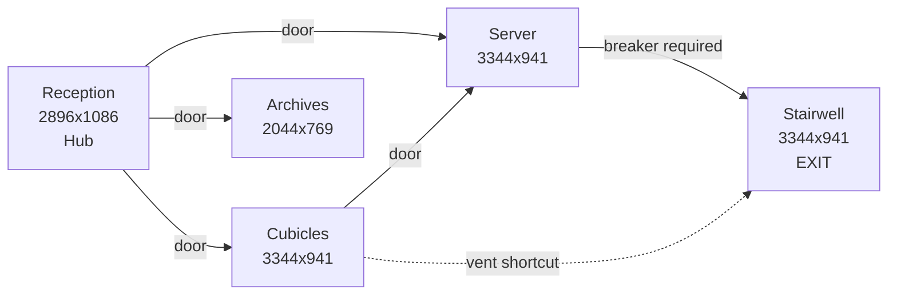
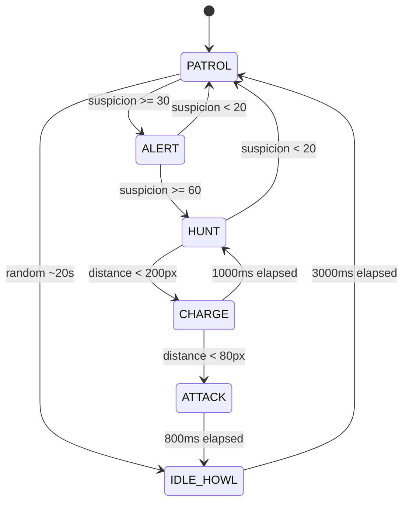
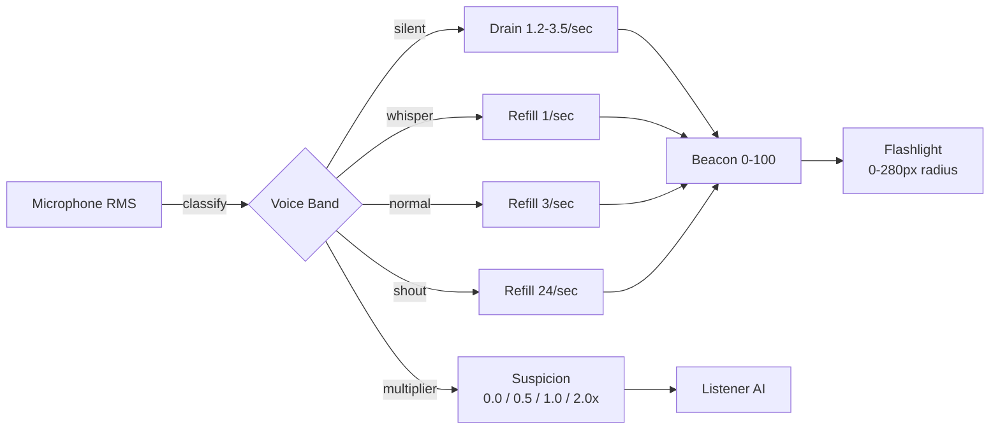
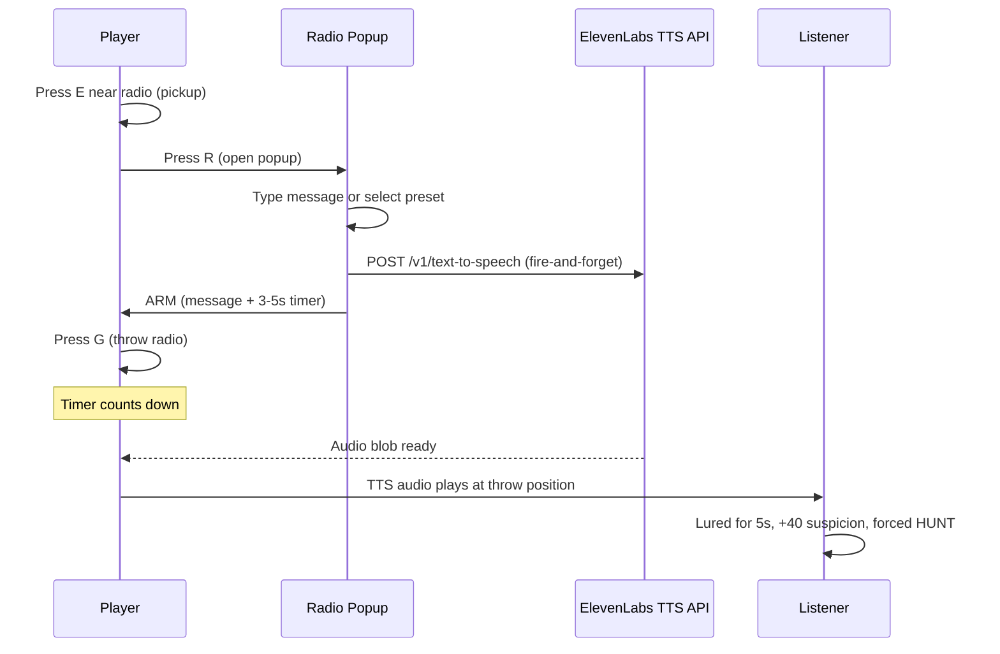
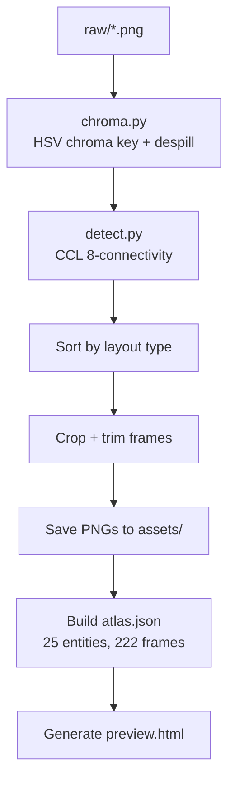

---

> **Built for [ElevenHacks Week 6](https://elevenhacks.com), the [Zed](https://zed.dev) x [ElevenLabs](https://elevenlabs.io) game challenge.**
> Submission deadline: 30 April 2026.

# 👂 Earshot

A 2D side-scrolling horror game where the monster hunts by sound. Your real microphone feeds into the game: speak to see (your voice powers the flashlight), but every sound you make draws the creature closer. Distract it by arming portable radios with custom text-to-speech messages via the [ElevenLabs](https://elevenlabs.io) API.

Built with Pixi.js and Howler.js. Hand-drawn pixel art processed through a custom Python atlas pipeline. Written in [Zed](https://zed.dev).


## Quick Start

```bash
npm install
pip install -r scripts/requirements.txt

# Set your ElevenLabs API key
echo "ELEVENLABS_API_KEY=sk-your-key-here" > .env

# Generate audio assets (requires ElevenLabs API key)
npm run audio:generate

# Slice sprite atlases from raw art (if you have raw/ PNGs)
npm run slice

# Start dev server
npm run dev
```

Open `http://localhost:5173`. Click to start. Allow microphone access when prompted.

## Controls

| Key | Action |
|-----|--------|
| A/D or Left/Right | Move |
| W/S or Up/Down | Climb ladders |
| Shift (hold) | Run |
| Ctrl (hold) | Crouch |
| E | Interact (doors, pickups, hiding spots) |
| R | Arm carried radio (opens popup) |
| G | Throw armed radio |
| 1/2/3 | Select inventory slot |
| Escape (hold 1s) | Skip intro panels |

## What It Does

The game drops the player into a 5-room abandoned office building. The objective: find a keycard, activate a breaker switch, and reach the exit in the stairwell. Three types of sound-sensitive creature patrol the rooms, reacting to noise picked up by the player's real microphone.

- **Intro sequence.** Three hand-drawn panels set the scene before the player can move. Click or press Space/Enter to advance. Hold Escape for 1 second to skip. Plays once per page load (not on restart after death).
- **Voice-activated vision.** Your flashlight runs on your voice. Speak to refill the beacon meter (0-100), which drives the flashlight radius (0-280px). Go silent and the light drains at 1.2-3.5 per second. Whisper to maintain a dim glow, talk for full brightness, shout to flood the room. But every sound also feeds the monster's suspicion meter.
- **3 monster types.** The Listener patrols with a 6-state AI driven by microphone input. The Jumper ambushes from ceiling vents. The Whisperer spawns at room corners and drains your beacon capacity with eerie voice lines generated by [ElevenLabs TTS](https://elevenlabs.io/docs/api-reference/text-to-speech).
- **Radio bait.** Pick up radios, type a message (up to 30 characters), set a 3-5 second timer, and throw. The message is synthesized in real time via ElevenLabs TTS and broadcast at the landing position, luring the Listener for 5 seconds.
- **Hiding spots.** Lockers (100% hidden, instant suspicion drop) and desks (80% hidden, 4x decay multiplier). The Listener cannot detect a player inside a locker.
- **Minimap.** Hidden until the player picks up the Map Fragment in Archives. Triggers a TTS narration line. Renders a 5-room hub-and-spokes layout with visited room tracking and a pulsing player dot. Persists through death.
- **Crafting.** Collect materials (wire, glass shards, battery, tape) scattered across rooms and craft items at the workbench in Reception: flares, smoke bombs, and decoy radios.
- **Dynamic atmosphere.** Screen shake on monster state changes, procedural heartbeat audio that scales with suspicion, a vignette that tightens with threat level, and a 4.7-second death cinematic sequence.

## How ElevenLabs Powers Earshot

The audio in Earshot is generated almost entirely by [ElevenLabs](https://elevenlabs.io). Every voice line, monster vocalization, ambient track, and sound effect comes from one of three ElevenLabs APIs.

| API | Used For | Catalog Entries |
|-----|----------|-----------------|
| [Text to Speech](https://elevenlabs.io/docs/api-reference/text-to-speech) | Radio bait (real-time), lore tapes (6), map narration (1), tutorials (4), whisperer voices (9), radio hints (4), intro narration (3) | 27 static + on-demand |
| [Sound Effects](https://elevenlabs.io/docs/api-reference/sound-effects) | Monster vocals (8), footsteps, doors, breaker, death, hiding, radio throw | 24 |
| [Music](https://elevenlabs.io/docs/api-reference/music) | Per-room ambient tracks for all 5 rooms | 5 |

**Real-time voice synthesis at the heart of gameplay.** The radio bait mechanic calls the ElevenLabs TTS endpoint at arm time (`POST /v1/text-to-speech/{voice_id}`). The player types a message, the API synthesizes it, and the audio plays at the radio's throw position in-world. Voice: Adam (`pNInz6obpgDQGcFmaJgB`). Model: `eleven_turbo_v2_5` (chosen for low latency). If the API call has not returned when the timer expires, the game falls back to a `static_burst` SFX.

**Story beats via narration.** Six lore tapes scattered across the rooms tell the facility's collapse through voice memos. Each is a 3-8 second narration generated via the TTS API. The map fragment in Archives triggers a 7th narration that contextualizes the minimap. Four tutorial voice memos introduce the mechanics on first play. All narration uses the Adam voice.

**Psychological horror via whisper.** The Whisperer enemy speaks 9 eerie voice lines ("behind you", "i can see you", "stay still") generated with the Bella voice (`EXAVITQu4vr4xnSDxMaL`) at low stability (0.3) for an unsettling, breathy quality.

**Procedural sound design.** Monster vocalizations were generated via the Sound Effects API using descriptive prompts ("slow, wet, raspy creature breathing" for PATROL, "explosive creature roar at full charge" for CHARGE). Each of the 6 Listener states has a distinct vocal track. Ambient music for each room was generated via the Music API with mood prompts ("loud humming server room ambience with low electrical drone" for Server).

The offline pipeline (`scripts/generate-audio.ts`) uses the [`@elevenlabs/elevenlabs-js`](https://www.npmjs.com/package/@elevenlabs/elevenlabs-js) SDK (v2.44.0) to batch-generate all 56 catalog entries. All 56 MP3 files are on disk.

## Architecture

```mermaid
graph TD
    subgraph Entry
        MAIN[main.ts] --> GAME[game.ts]
        MAIN --> ASSETS[assets.ts]
    end

    subgraph "Game Logic"
        GAME --> PLAYER[player.ts]
        GAME --> MONSTER[monster.ts<br>Listener AI]
        GAME --> JUMPER[jumper.ts<br>Ceiling ambush]
        GAME --> WHISPERER[whisperer.ts<br>Beacon drain]
        GAME --> ROOMS[rooms.ts<br>5 rooms]
        GAME --> INPUT[input.ts]
        GAME --> PICKUP[pickup.ts]
        GAME --> HIDING[hiding.ts]
    end

    subgraph "Audio Pipeline"
        GAME --> AUDIO[audio.ts<br>Howler wrapper]
        AUDIO --> CATALOG[audio-catalog.ts<br>56 entries]
        GAME --> MIC[mic.ts<br>RMS analyser]
        MIC --> SUSPICION[suspicion.ts]
        GAME --> BEACON[beacon.ts]
        GAME --> HEARTBEAT[heartbeat.ts]
        GAME --> TTS[tts.ts]
    end

    subgraph Rendering
        GAME --> HUD[hud.ts]
        HUD --> MINIMAP[minimap.ts<br>5-room parchment]
        GAME --> FLASHLIGHT[flashlight.ts]
        GAME --> VIGNETTE[vignette.ts]
        GAME --> SHAKE[screen-shake.ts]
        GAME --> TRANSITION[transition.ts]
    end

    subgraph "Items & Crafting"
        GAME --> CRAFTING[crafting.ts]
        GAME --> WORKBENCH[workbench-menu.ts]
        GAME --> PROJECTILE[projectile.ts]
    end

    subgraph UI
        GAME --> RADIO_POPUP[radio-popup.ts]
    end

    TTS -->|POST /api/tts| PROXY[Vercel Proxy]
    PROXY -->|POST| ELEVEN[ElevenLabs API]
    MIC -->|getUserMedia| WEBMIC[Browser Microphone]
```



## Project Structure

```
src/
  main.ts              Entry point, title screen
  game.ts              Central orchestrator, game loop
  types.ts             Shared types and GameState factory
  assets.ts            Atlas manifest loader, texture registry
  input.ts             Keyboard capture with edge detection
  player.ts            Player sprite, movement, 8 animation states
  monster.ts           6-state Listener AI, suspicion tracking, lure system
  jumper.ts            Ceiling ambush predator (vent drop)
  whisperer.ts         Psychological drain ghost (beacon erosion)
  rooms.ts             5 room definitions, door/prop layouts
  room.ts              Room background sprite container
  pickup.ts            Collectable items (keycard, breaker, materials, tapes)
  hiding.ts            Interactive hiding spots (locker, desk)
  beacon.ts            Voice-activated vision meter, suspicion multiplier
  crafting.ts          Crafting recipes and inventory management
  workbench-menu.ts    HTML overlay for crafting UI
  audio.ts             Howler wrapper, ambient crossfade, master volume
  audio-catalog.ts     56 audio asset definitions with generation prompts
  mic.ts               Microphone RMS analyser
  suspicion.ts         RMS-to-suspicion curve (piecewise linear)
  tts.ts               ElevenLabs TTS client (radio bait, runtime)
  hud.ts               Suspicion meter, prompts, status indicators
  minimap.ts           Parchment minimap (5-room layout, visited tracking)
  flashlight.ts        Radial darkness overlay (driven by beacon)
  vignette.ts          Edge darkening by threat level
  screen-shake.ts      Camera jitter with decay
  heartbeat.ts         Procedural Web Audio heartbeat (60Hz + 80Hz)
  radio-popup.ts       HTML modal for composing radio messages
  transition.ts        Fade-to-black scene transitions
  shade.ts             Death shade (inventory ghost)
  flare-effect.ts      Flare projectile with light radius
  smokebomb-effect.ts  Smoke bomb area effect
  decoy-effect.ts      Decoy radio broadcast effect
  projectile.ts        Throwable item physics
scripts/
  slice.py             Atlas pipeline orchestrator
  atlas_config.py      53 atlas profile definitions
  chroma.py            HSV chroma key with despill
  detect.py            Connected-component label detection
  generate-audio.ts    ElevenLabs audio asset generator
assets/
  atlas.json           Sprite manifest (25 entities, 222 frames)
  audio/               56 MP3 files (all catalog entries present)
  player/              31 player sprite PNGs
  monster/             27 monster sprite PNGs
  props/               12 prop sprite PNGs
  *.png                Room backgrounds, title, gameover
```

34 TypeScript source files. 122 public exports.

## Rooms

Reception is the hub. The player starts there and can reach Cubicles, Server, or Archives directly. The Stairwell (containing the exit) is only accessible through Server after activating the breaker.



| Room | Size | Monsters | Key Items |
|------|------|----------|-----------|
| Reception | 2896x1086 | None | Workbench, tape, lore tape 01 |
| Cubicles | 3344x941 | Listener, 2 Jumpers | Keycard, glass shards, lore tape 02. 7 foreground dividers, 2 desks, 1 locker, 1 radio. Vent to Stairwell |
| Server | 3344x941 | Listener, 2 Jumpers | Breaker, wire, lore tape 03. Upper floor with ladder at x=1400. 2 lockers, 1 radio |
| Stairwell | 3344x941 | Listener, 2 Jumpers, Whisperer (40%) | Lore tape 06. 1 desk. Vent to Cubicles. EXIT requires keycard |
| Archives | 2044x769 | Whisperer (30%) | Battery, map fragment, lore tapes 04+05. 1 desk. Beacon drains 1.5x faster |

## Monsters

### Listener (monster.ts)

The primary threat. A 6-state finite state machine driven by microphone input.



| State | Speed (px/frame) | Behavior |
|-------|-----------------|----------|
| PATROL | 1.5 | Wanders patrol zone |
| ALERT | 1.5 | 1500ms windup, checks if suspicion reaches 60 |
| HUNT | 2.1 | Moves toward player or lure target |
| CHARGE | 4.5 | Rushes player |
| ATTACK | 0 | 800ms attack animation |
| IDLE_HOWL | 0 | 3s howl, then returns to PATROL |

Catch distance: 80px. The Listener catches the player when within range during HUNT, CHARGE, ATTACK, or IDLE_HOWL states.

Base suspicion decay: 5 per second. Crouching multiplies decay by 3x. Desk hiding multiplies by 4x. Locker hiding drops suspicion to 0 instantly. Decay applies in PATROL, ALERT, HUNT, and CHARGE (not during ATTACK or IDLE_HOWL).

### Jumper (jumper.ts)

Ceiling ambush predator. Hides dormant in vent hotspots above the player's path. Triggered when the player walks beneath. Drops from the vent, attacks, then retreats back up. States: dormant, triggered, falling, attacking, retreating. Some hotspots are on the Server upper floor.

### Whisperer (whisperer.ts)

Psychological drain ghost. Spawns at room corners with a per-room probability (Stairwell 40%, Archives 30%). Glides toward the player while speaking eerie voice lines via [ElevenLabs TTS](https://elevenlabs.io) (Bella voice, `EXAVITQu4vr4xnSDxMaL`). Looking at the Whisperer erodes the beacon's maximum capacity from 100 down to a floor of 50. States: spawning, idle, fading, despawned.

## Beacon System

The beacon meter is the core tension mechanic. Your voice is both your light source and your biggest risk.



| Voice Band | RMS Threshold | Beacon Effect | Suspicion Multiplier |
|------------|---------------|---------------|---------------------|
| Silent | < 0.01125 | Drain 1.2/sec (3.5/sec below 30) | 0.0x |
| Whisper | 0.01125 - 0.0225 | Refill 1/sec | 0.5x |
| Normal | 0.0225 - 0.0675 | Refill 3/sec | 1.0x |
| Shout | > 0.0675 | Refill 24/sec | 2.0x |

The Whisperer permanently reduces the beacon's maximum when it looks at the player. The floor is 50 (half of the starting max of 100).

## Radio Bait



If the player holds the radio when the timer expires (not thrown): +50 suspicion, screen flash, "RADIO MALFUNCTIONED" message.

Presets: HELP ME, OVER HERE, AAAAH, STAY BACK. Max 30 characters. Timer range: 3-5 seconds.

Voice: Adam (`pNInz6obpgDQGcFmaJgB`), model: `eleven_turbo_v2_5`. TTS requests are proxied through a Vercel serverless function (`api/tts.ts`); the API key stays server-side.

## Audio

56 audio assets defined in `src/audio-catalog.ts`. All 56 MP3 files are on disk.

| Category | Count | Source API | Examples |
|----------|-------|------------|---------|
| Ambient | 5 | Music | reception, cubicles, server, stairwell, archives |
| Monster Vocals | 6 | Sound Effects | patrol_breath, alert_growl, hunt_screech, charge_roar, attack_lunge, idle_howl |
| Monster Confused | 2 | Sound Effects | confused_growl, monster_growl_close |
| SFX | 16 | Sound Effects | footsteps, doors, breaker, keycard, death_thud, hiding (locker/desk), static_burst, radio_throw |
| Radio Hints | 4 | TTS (Adam voice) | radio_intro, keycard_hint, breaker_hint, exit_hint |
| Whisperer | 9 | TTS (Bella voice) | whisper_01..08, whisper_fade |
| Lore Tapes | 7 | TTS (Adam voice) | tape_01..06, tape_map_fragment |
| Tutorials | 4 | TTS (Adam voice) | tutorial_t0..t3 |
| Intro Narration | 3 | TTS (Adam voice) | intro_panel_1..3 |

The procedural heartbeat (`heartbeat.ts`) is synthesized at runtime using Web Audio oscillators at 60Hz and 80Hz. BPM: silent below suspicion 30, scales from 50 BPM at 30 to 160 BPM at 100.

## Asset Pipeline



53 atlas profiles defined in `atlas_config.py`. Pipeline commands:

```bash
npm run slice          # Process all atlases
npm run slice:clean    # Delete generated assets first, then process
npm run slice:debug    # Save debug overlays showing detected bounding boxes
```

For pipeline details, see [scripts/README.md](scripts/README.md).

## Configuration

| Variable | Required | Default | Description |
|----------|----------|---------|-------------|
| `ELEVENLABS_API_KEY` | Yes | (none) | [ElevenLabs](https://elevenlabs.io) API key. Used server-side by the Vercel TTS proxy (`api/tts.ts`) and by `generate-audio.ts` for offline asset generation. |

## Tech Stack

| Technology | Version | Purpose |
|------------|---------|---------|
| [Pixi.js](https://pixijs.com/) | ^8.0.0 | 2D rendering, sprite management |
| [Howler.js](https://howlerjs.com/) | ^2.2.4 | Audio playback, ambient crossfade |
| [Vite](https://vitejs.dev/) | ^6.0.0 | Dev server, bundling, env injection |
| [TypeScript](https://www.typescriptlang.org/) | ^5.0.0 | Type checking |
| [@elevenlabs/elevenlabs-js](https://www.npmjs.com/package/@elevenlabs/elevenlabs-js) | ^2.44.0 | Offline audio asset generation pipeline |
| [Zed](https://zed.dev) | (editor) | Code editor used throughout the hackathon |
| Python 3 | (system) | Asset pipeline (Pillow, NumPy, SciPy) |

## Tradeoffs and Limitations

- The [ElevenLabs](https://elevenlabs.io) API key is held server-side via the `/api/tts` proxy. It does not appear in the client bundle.
- Microphone sensitivity varies by hardware. The suspicion curve was recalibrated (v2, modere preset: +50% RMS thresholds, -20% curve output) to reduce false positives from ambient noise and breathing. Beacon drain rates are unchanged. Other setups may still trigger too easily or not at all.
- All 56 audio catalog entries have corresponding MP3 files on disk.
- `tsconfig.json` has `noImplicitAny: false`. Strict typing is not enforced.
- No automated tests.
- Fixed 1280x720 viewport (set in `index.html`). No responsive scaling.
- Some craftable item sprite frames (flare igniting/dying, smokebomb ignited) exist in the atlas but are not used by the effect code.

## Documentation

| Document | Description |
|----------|-------------|
| [ARCHITECTURE.md](ARCHITECTURE.md) | System design, component internals, data flow diagrams |
| [scripts/README.md](scripts/README.md) | Asset pipeline details, tuning parameters |
| [docs/DAY2_GAMEPLAY.md](docs/DAY2_GAMEPLAY.md) | Dev journal: gameplay skeleton, room/monster design |
| [docs/DAY3_AUDIO.md](docs/DAY3_AUDIO.md) | Dev journal: audio integration, mic-to-suspicion pipeline |
| [docs/DAY4_HIDING_AND_PROPS.md](docs/DAY4_HIDING_AND_PROPS.md) | Dev journal: hiding spots, props system |
| [docs/DAY4_RADIO_BAIT.md](docs/DAY4_RADIO_BAIT.md) | Dev journal: radio bait with [ElevenLabs](https://elevenlabs.io) TTS |
| [docs/DAY5_POLISH.md](docs/DAY5_POLISH.md) | Dev journal: screen shake, heartbeat, vignette, death sequence |

## Building

```bash
# Type-check and bundle for production
npm run build

# Preview the production build
npm run preview
```

Output goes to `dist/`. Build target is ES2020.

## Deployment

Deploy to Vercel:

```bash
npx vercel               # preview deployment
npx vercel --prod        # production deployment
```

Required Vercel environment variable (Production scope):
- `ELEVENLABS_API_KEY` -- the ElevenLabs API key for runtime TTS.

Set it in Vercel project settings under Environment Variables, not in committed files.

The TTS API key is held server-side via a Vercel serverless function at
`api/tts.ts`. The browser never sees the key. ElevenLabs requests are
forwarded through `/api/tts` with the key injected at runtime from
`process.env.ELEVENLABS_API_KEY`.

Local development:
- `npm run dev` runs Vite only. Radio bait falls back to static_burst SFX.
- `npx vercel dev` runs Vite plus the serverless function. Radio bait works fully.

The offline asset generation script (`scripts/generate-audio.ts`) still reads
the key from `.env` directly and is unchanged.

## Credits and Attribution

Built during [ElevenHacks Week 6](https://elevenhacks.com) (April 2026), the [Zed](https://zed.dev) x [ElevenLabs](https://elevenlabs.io) game challenge.

- **[ElevenLabs](https://elevenlabs.io)** for the audio AI suite. Earshot would be a silent game without ElevenLabs. The radio bait mechanic, the 6 lore tapes, the 4 tutorial voice memos, the 9 whisperer voice lines, the monster vocalizations, and the per-room ambient tracks all run on ElevenLabs APIs: [Text to Speech](https://elevenlabs.io/docs/api-reference/text-to-speech), [Sound Effects](https://elevenlabs.io/docs/api-reference/sound-effects), and [Music](https://elevenlabs.io/docs/api-reference/music). Voices: Adam (`pNInz6obpgDQGcFmaJgB`), Bella (`EXAVITQu4vr4xnSDxMaL`). Models: `eleven_turbo_v2_5`, `eleven_v3`. Tag: [@elevenlabsio](https://x.com/elevenlabsio).
- **[Zed](https://zed.dev)** for the editor. Earshot was written entirely in Zed during the hackathon. Tag: [@zeddotdev](https://x.com/zeddotdev).

`#ElevenHacks`
