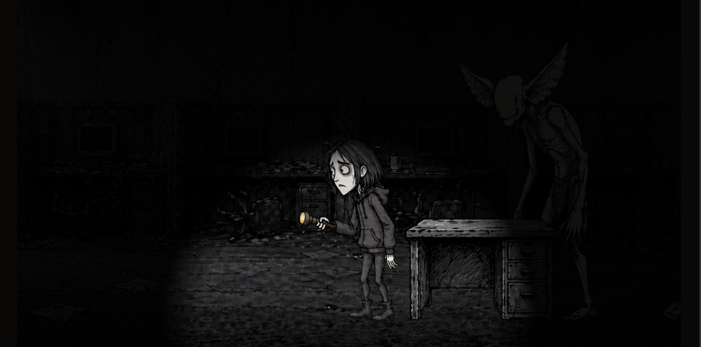

**Hear them before they hear you.**

> ElevenHacks Hackathon. A horror game where your microphone is the controller. Whisper to live. Speak and the building wakes up.

[](https://earshot.vercel.app)




🎙️ You wake up in an abandoned office building. Five rooms. The lights are dying, the doors are locked, and something in the dark is listening. To get out, you need a keycard, the breaker back on, and enough nerve to reach the exit before the building takes you.

🎮 Every sound matters. Whisper and your flashlight stays alive. Speak and something turns its head. Run and you wake the whole floor. The monsters don't care if they can see you. They care if they can hear you.

## 👁️ The Monsters

Three of them share the building.

The Listener hunts by sound. A 6-state AI driven entirely by your microphone input. The Whisperer won't let you past her trapdoor until you whisper a phrase she gives you, into your actual mic. The Jumpers wait in the vents (ceiling and floor) and drop when you get too close.

## 🎯 What you do

Pick up a radio, type a message, throw. ElevenLabs turns your text into speech in real time, luring the Listener to the landing spot. Solve a breaker puzzle by ear. Reconstruct broken tape recordings at the workbench. Hide in lockers and under desks. Crouch to move silent. Run when you have to and pay the noise tax.

## 🏃 Run it

```bash
npm install
cp .env.example .env
# add your ELEVENLABS_API_KEY
npm run dev
```

Open http://localhost:5173. Allow microphone access. For live radio TTS, run `npx vercel dev` instead.

## 🛠️ Built with

- **[Pixi.js](https://pixijs.com/)** for 2D rendering
- **[Howler.js](https://howlerjs.com/) + Web Audio API** for sound
- **[ElevenLabs](https://elevenlabs.io)** for everything that speaks (Sound Effects, TTS, Music)
- **TypeScript** and **Vite**

## 📖 Docs

- [Architecture](ARCHITECTURE.md)
- [Changelog](docs/CHANGELOG.md)
- [Build journal](docs/journal/)

## 🎬 The ending

You make it to the exit. You step through the door. You think you're free.

You never left.

---

Built solo. Five days. For the [@elevenlabsio](https://x.com/elevenlabsio) x [@zeddotdev](https://x.com/zeddotdev) hackathon. [#ElevenHacks](https://elevenhacks.com)
