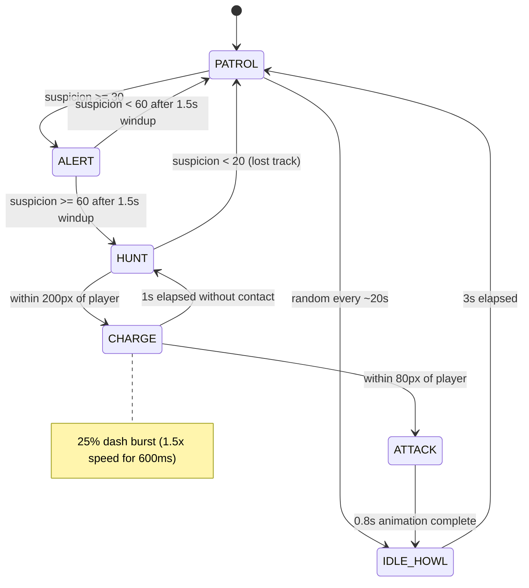
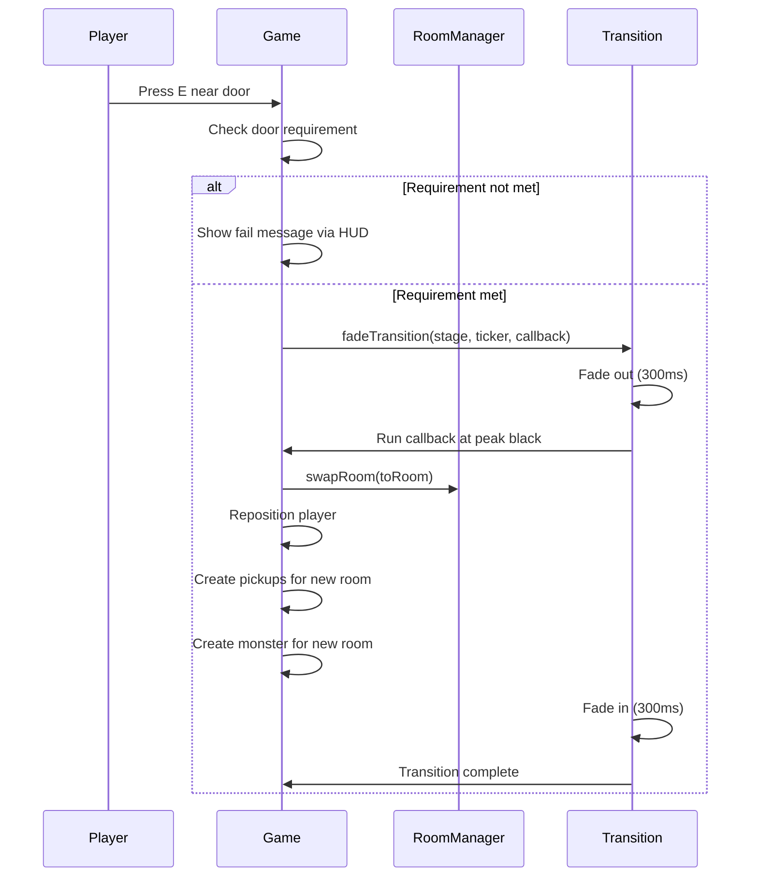
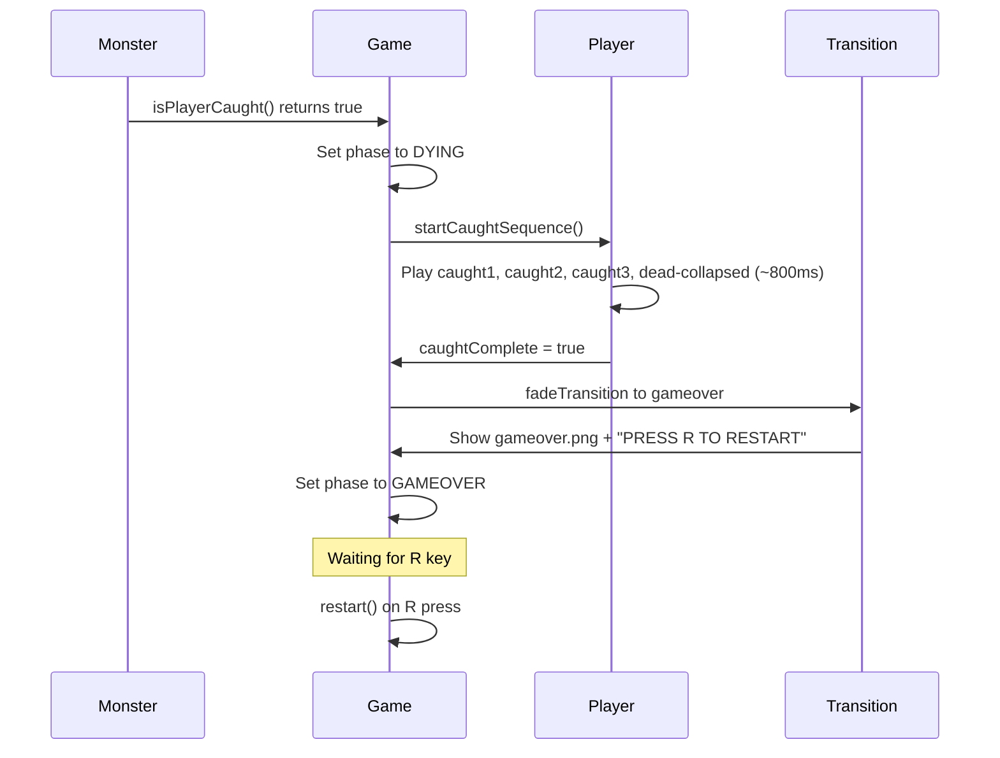
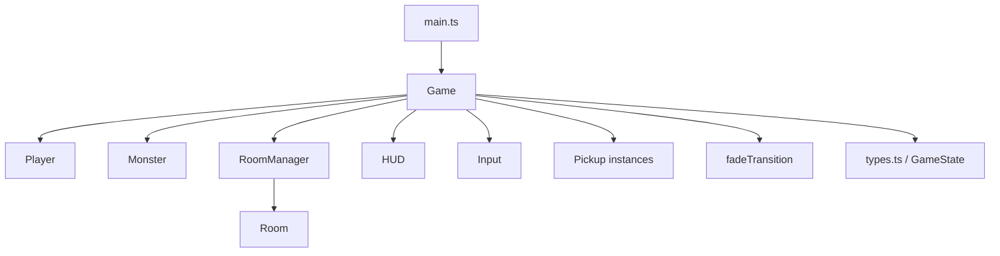

# Day 2: Gameplay Skeleton

Day 2 implements the full game loop: four interconnected rooms, a six-state monster AI, item pickups, locked doors, death/respawn, and win condition. All gameplay is driven by deterministic state machines. Audio integration (mic-driven suspicion) is deferred to Day 3; debug keys substitute for testing.

## Quick start

```bash
npm run dev
```

Open `http://localhost:5173`. Use these controls:

| Key | Action |
|---|---|
| Arrow Left / A | Move left |
| Arrow Right / D | Move right |
| Shift | Run |
| Ctrl | Crouch |
| E | Interact (door, pickup) |
| R | Restart (gameover/win screen only) |

### Debug keys (Day 2 only, tagged `DEBUG_DAY2:`)

| Key | Monster state |
|---|---|
| 1 | PATROL |
| 2 | ALERT |
| 3 | HUNT |
| 4 | CHARGE (Listener) |
| 5 | ATTACK |
| 6 | IDLE_HOWL |
| 0 | Dump GameState to console |

Debug keys only work during PLAYING phase in rooms with a monster (cubicles, server, stairwell). Reception has no monster.

## Monster state diagram



### Suspicion model

- Range: 0 to 100.
- Decay: 5 per second during PATROL only. Frozen in all other states.
- Day 3 integration: call `monster.addSuspicion(micVolume * 50 * dtSec)` each frame.
- Debug keys set suspicion to a value matching the forced state.

## Room transition sequence



## Death flow sequence



## Architecture



`Game` owns all subsystems. `GameState` is the single source of truth for phase, inventory, and room. On restart, the entire `Game` instance is replaced with a fresh one.

## Room layout

| Room | Width | Monster | Pickups | Doors |
|---|---|---|---|---|
| reception | 2896px | none | none | right: cubicles (E) |
| cubicles | 3344px | patrol 600-2800, spawn 2200 | keycard at x=1600 | left: reception (E), right: server (E) |
| server | 3344px | patrol 600-2800, spawn 1800 | breaker at x=2600 | left: cubicles (E), right: stairwell (breaker) |
| stairwell | 3344px | patrol 600-2800, spawn 2000 | none | left: server (E), right: EXIT (keycard) |

## Edge case reference

| # | Scenario | Behavior |
|---|---|---|
| 1 | E with nothing nearby | No-op, no crash |
| 2 | E near both door and pickup | Pickup wins (checked first) |
| 3 | Walk into room boundary | Stops at edge, no jitter |
| 4 | Walk past right edge with no door | Stops at boundary |
| 5 | Monster catches during room transition | Transition wins (locked flag active) |
| 6 | R during PLAYING | Ignored |
| 7 | 1-6 during GAMEOVER | Ignored (debug keys only run in PLAYING) |
| 8 | Collect keycard, die, restart | Inventory reset to empty |
| 9 | Flip breaker, die, restart | breakerOn reset to false |
| 10 | Monster in CHARGE when player exits | Monster destroyed, new room gets fresh PATROL monster |
| 11 | Re-enter a room | Monster respawns in PATROL (Day 2 simplification) |
| 12 | Window resize | Canvas is fixed 1280x720, no resize handling needed |
| 13 | Atlas frame missing | console.error with frame name, fallback to WHITE texture |
| 14 | Invalid state transition (dev) | Throws Error in dev, console.warn in production |

## Day 3 integration notes

### What to remove

Grep for `DEBUG_DAY2:` to find all debug-only code:

- `src/game.ts`: `handleDebugKeys()` method and its call in `handlePlayingTick()`
- `src/monster.ts`: `forceState()` method (or keep for testing)

### What to wire up

1. Mic analyser feeds into `monster.addSuspicion(amount)` each frame.
2. Suspicion drives organic state transitions (PATROL -> ALERT -> HUNT -> CHARGE -> ATTACK).
3. The state machine, transition table, and catch detection are already complete.

### Flashlight / darkness overlay

Not implemented in Day 2. Add as a stage-level overlay with a circular mask centered on the player.

## Known limitations

- Monsters reset to PATROL on every room entry (no persistent monster state across rooms).
- Catch detection uses horizontal distance only (no vertical component, appropriate for side-view).
- Player can outrun the monster at full sprint (intentional: running generates noise in Day 3).
- No sound effects or visual feedback beyond HUD text messages for interactions.
- Prop sprites use a fixed 0.3x scale factor (may need adjustment per prop).
