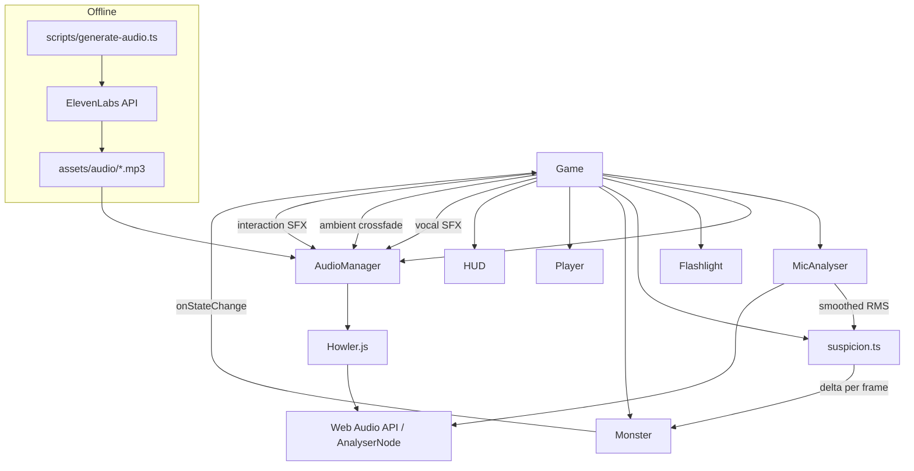
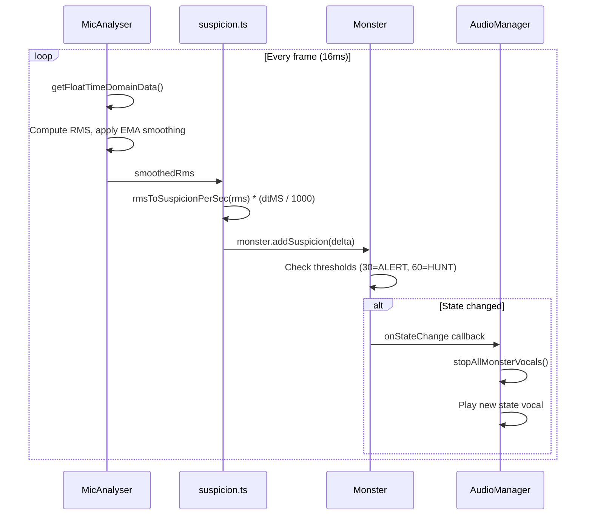

# Day 3: Audio, Microphone, Flashlight

Day 3 replaces the Day 2 debug keys with real-time microphone input. The player's real-world voice volume drives the monster's suspicion meter: whispering keeps suspicion low, talking spikes it, shouting maxes it. Each room has ambient music, the monster has voice lines per state, and key interactions have sound effects. A flashlight darkness overlay limits visibility to a circle around the player.

## Quick start

```bash
# 1. Install dependencies (if not already)
npm install

# 2. Set your ElevenLabs API key
echo "ELEVENLABS_API_KEY=sk-..." > .env

# 3. Generate audio assets (one-time, takes ~3 minutes)
npm run audio:generate

# 4. Run the dev server
npm run dev
```

Open `http://localhost:5173`. Click to start. Grant microphone access when prompted.

### Audio asset regeneration

```bash
# List all assets without generating
npm run audio:list

# Regenerate all missing assets
npm run audio:generate

# Force regenerate a specific asset
npx tsx scripts/generate-audio.ts --only monster_alert_growl --force
```

Generated MP3 files live in `assets/audio/`. The ElevenLabs API key is in `.env` (gitignored, never shipped to the browser).

### Microphone permission

On first click, the browser prompts for microphone access. If denied or unavailable:
- The game is still fully playable
- Suspicion stays at 0 (the monster patrols passively)
- A toast message explains the limitation

## Architecture



## Mic-to-suspicion flow



## Audio asset reference

| ID | Category | Source API | Loop | Volume |
|---|---|---|---|---|
| reception_ambient | ambient | Music | yes | 0.4 |
| cubicles_ambient | ambient | Music | yes | 0.4 |
| server_ambient | ambient | Music | yes | 0.5 |
| stairwell_ambient | ambient | Music | yes | 0.5 |
| monster_patrol_breath | monster_vocal | Sound Effects | yes | 0.6 |
| monster_alert_growl | monster_vocal | Sound Effects | no | 0.8 |
| monster_hunt_screech | monster_vocal | Sound Effects | no | 0.8 |
| monster_charge_roar | monster_vocal | Sound Effects | no | 1.0 |
| monster_attack_lunge | monster_vocal | Sound Effects | no | 1.0 |
| monster_idle_howl | monster_vocal | Sound Effects | no | 0.9 |
| footstep_concrete | sfx | Sound Effects | no | 0.4 |
| footstep_concrete_run | sfx | Sound Effects | no | 0.5 |
| flashlight_click | sfx | Sound Effects | no | 0.6 |
| door_open_creak | sfx | Sound Effects | no | 0.5 |
| door_locked_rattle | sfx | Sound Effects | no | 0.5 |
| breaker_switch | sfx | Sound Effects | no | 0.7 |
| keycard_pickup | sfx | Sound Effects | no | 0.5 |
| player_breath_normal | sfx | Sound Effects | yes | 0.3 |
| win_chime | sfx | Sound Effects | no | 0.7 |
| death_thud | sfx | Sound Effects | no | 0.8 |
| radio_intro | radio_voice | TTS (eleven_v3) | no | 0.8 |
| radio_keycard_hint | radio_voice | TTS (eleven_v3) | no | 0.8 |
| radio_breaker_hint | radio_voice | TTS (eleven_v3) | no | 0.8 |
| radio_exit_hint | radio_voice | TTS (eleven_v3) | no | 0.8 |
| tape_01..tape_06 | lore_tape | TTS (eleven_turbo_v2_5, Adam) | no | 0.8 |
| tape_map_fragment | lore_tape | TTS (eleven_turbo_v2_5, Adam) | no | 0.85 |
| tutorial_t0..t3 | lore_tape | TTS (eleven_turbo_v2_5, Adam) | no | 0.85 |
| intro_panel_1 | intro_vo | TTS (eleven_turbo_v2_5, Adam) | no | 0.85 |
| intro_panel_2 | intro_vo | TTS (eleven_turbo_v2_5, Adam) | no | 0.85 |
| intro_panel_3 | intro_vo | TTS (eleven_turbo_v2_5, Adam) | no | 0.85 |

## Suspicion curve

The mapping from mic RMS to suspicion-per-second is piecewise linear, tuned so whispering is safe and normal speech triggers ALERT quickly:

| RMS range | Label | Suspicion/sec | Time to ALERT (30) |
|---|---|---|---|
| < 0.01125 | silence | 0 | never |
| 0.01125 - 0.0225 | whisper | 0 - 6.4 | 30+ seconds |
| 0.0225 - 0.0675 | normal | 6.4 - 32 | ~1.5 seconds |
| 0.0675 - 0.18 | loud | 32 - 72 | < 1 second |
| > 0.18 | shout | 72 - 96 | < 0.5 seconds |

Thresholds live in `src/suspicion.ts` (calibration v2, modere preset: +50% RMS thresholds, -20% curve output). Smoothing alpha (0.2) lives in `src/mic.ts`.

### Tuning guide

If ALERT triggers too easily at a whisper, lower the slope in the 0.01-0.04 range. If normal speech does not trigger ALERT within 1 second, raise the slope in the 0.04-0.15 range. The EMA smoothing factor (0.2) controls responsiveness: lower = smoother but laggier, higher = more reactive but jittery.

## Microphone constraints

```typescript
navigator.mediaDevices.getUserMedia({
  audio: {
    echoCancellation: false,
    noiseSuppression: false,
    autoGainControl: false,
  },
});
```

All three are disabled to prevent a feedback loop where the monster's speaker output is picked up by the mic, amplified by AGC, and spikes suspicion. This is the single most important audio decision in the build.

## Edge case reference

| # | Scenario | Behavior |
|---|---|---|
| 1 | User denies mic permission | Game playable, suspicion locked at 0, toast message |
| 2 | No mic device | Same as denied, different toast |
| 3 | Mic disconnected mid-game | MediaStreamTrack.onended fires, suspicion drops to 0, toast |
| 4 | Browser blocks audio until gesture | Click-to-start overlay resumes AudioContext |
| 5 | Slow asset load | Loading screen with progress percentage |
| 6 | Asset load failure | Logged, non-blocking (game works without individual SFX) |
| 7 | Multiple rapid room transitions | crossfadeAmbient no-ops if same track, cancels previous fade |
| 8 | Monster state changes faster than vocal | stopAllMonsterVocals before playing new vocal |
| 9 | Speaker bleed into mic | echoCancellation/NS/AGC all false prevents feedback loop |
| 10 | Tab loses focus | audioManager.suspend() pauses AudioContext |
| 11 | Tab regains focus | audioManager.resume() resumes AudioContext |
| 12 | Restart via R key | Audio stays loaded, mic stays active, ambient resets |

## Day 4 polish notes

- Spatial panning: adjust monster vocal L/R balance based on monster position relative to player
- Dynamic music intensity: layer additional instruments as suspicion rises
- Breathing SFX: loop player_breath_normal, increase rate when running
- Radio operator dialogue: play TTS lines in reception as a tutorial
- Volume slider: UI control for master volume and mic sensitivity
- Headphone detection: suggest headphones to avoid speaker bleed
