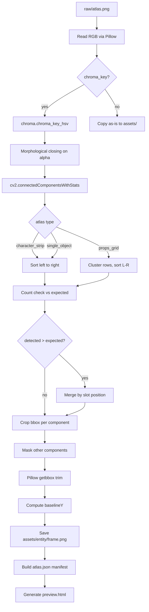

# Earshot Asset Pipeline

Python pipeline that reads sprite atlases from `raw/`, chroma keys the green background, detects individual sprites via connected component labeling (CCL), and writes trimmed transparent PNGs to `assets/` with an `atlas.json` manifest for the game engine.

Replaces the previous Node/sharp slicer (`slice.js`) which failed on atlases where action poses (claws, jaws, flashlight beams) extended across frame boundaries.

## Quick start

```bash
pip install -r scripts/requirements.txt
npm run slice          # slice all atlases
npm run slice:clean    # wipe assets/ first, then slice
npm run slice:debug    # save debug overlays to assets/_debug/
```

To re-slice a single atlas:

```bash
python scripts/slice.py --only monster-attack.png
```

## Pipeline architecture



## Modules

### `atlas_config.py`

Data-only configuration. One entry per atlas file in `raw/`. Each entry declares:

| Field | Purpose |
|---|---|
| `type` | `character_strip`, `props_grid`, `single_object`, or `background` |
| `entity` | Output directory name and manifest key (e.g. `player`, `monster`, `props`) |
| `frames` | Ordered list of frame names matching expected detection order |
| `chroma_key` | Whether to remove the green background |
| `closing_kernel` | Optional `(width, height)` override for morphological closing |

Multiple atlases can share an `entity` (e.g. all `player-*.png` atlases produce frames under `assets/player/`). Frame names must be unique within an entity.

### `chroma.py`

HSV chroma key with channel-min despill and distance-transform edge feathering.

**How it works:**

1. Convert RGB to HSV via OpenCV
2. Threshold for green background pixels (H: 35-85, S: 80-255, V: 80-255)
3. Clean speckle in the mask with morphological open
4. Invert to get the foreground mask
5. Despill: where green exceeds `max(red, blue) + 5`, reduce green to that level
6. Build alpha from the foreground mask, with an inward feather ramp over 2 pixels

The HSV bounds were verified against corner pixel samples from all 17 source atlases. The green background in these images is not pure `#00FF00` but consistently falls within the threshold range (typically H~61, S~241, V~237 in OpenCV scale).

**Tuning:**

| Parameter | Default | Where | Purpose |
|---|---|---|---|
| `HSV_LOWER / HSV_UPPER` | `[35,80,80] / [85,255,255]` | `chroma.py` | Green detection bounds |
| `DESPILL_THRESHOLD` | `5` | `chroma.py` | How aggressively green spill is removed |
| `feather_radius` | `2` | `chroma.py` | Alpha edge softening (pixels inward) |

### `detect.py`

Sprite detection via `cv2.connectedComponentsWithStats` with 8-connectivity.

**How it works:**

1. Take the alpha channel from the chroma-keyed RGBA
2. Threshold to binary (alpha > 0)
3. Apply morphological closing with a horizontal rectangular kernel to bridge intra-sprite gaps (e.g. between a character's head and outstretched arm)
4. Run CCL to find connected components
5. Filter out components below 500 pixels (noise)
6. Sort by layout type: left-to-right for strips, row-clustered for grids

The closing kernel is wider than tall (default 21x7) because limb extensions in these atlases are typically horizontal. The kernel bridges gaps within a sprite without bridging across adjacent sprites.

**Tuning:**

| Parameter | Default | Where | Purpose |
|---|---|---|---|
| `DEFAULT_CLOSING_KERNEL` | `(21, 7)` | `detect.py` | Gap bridging size (width, height) |
| `MIN_COMPONENT_AREA` | `500` | `detect.py` | Noise filter threshold |
| `ROW_OVERLAP_THRESHOLD` | `0.5` | `detect.py` | Grid row clustering sensitivity |

Per-atlas kernel overrides go in `atlas_config.py` as `"closing_kernel": (w, h)`.

### `slice.py`

Pipeline orchestrator. For each atlas:

1. Reads the profile from `atlas_config.py`
2. Applies chroma key (if enabled)
3. Detects components via CCL
4. If more components than expected, merges by horizontal slot position (handles detached elements like dropped flashlights, blood splatters)
5. Extracts each component with per-component masking (prevents pixel leaking from overlapping bounding boxes)
6. Trims transparent margins via `Pillow.getbbox()`
7. Computes `baselineY` (bottom-most non-transparent row for sprite anchoring)
8. Saves individual PNGs and builds `atlas.json`

## Atlas profiles

| Atlas | Type | Entity | Expected frames | Kernel override |
|---|---|---|---|---|
| `player-base.png` | character_strip | player | 7 (idle, walk1-4, crouch, dead) | default |
| `player-run.png` | character_strip | player | 6 (run1-4, run-stop, run-look-back) | default |
| `player-crouch.png` | character_strip | player | 6 (crouch-idle1-2, crouch-walk1-4) | default |
| `player-scared.png` | character_strip | player | 6 (scared-idle1-2, scared-walk1-4) | default |
| `player-caught.png` | character_strip | player | 6 (caught1-3, dead-collapsed/blood/flashlight-out) | default |
| `monster-base.png` | character_strip | monster | 6 (idle1-2, walk1-4) | default |
| `monster-alert.png` | character_strip | monster | 6 (alert1-2, hunt1-4) | default |
| `monster-charge.png` | character_strip | monster | 6 (charge1-4, attack1-2) | default |
| `monster-attack.png` | character_strip | monster | 3 (attack3, howl1-2) | default |
| `props.png` | props_grid | props | 12 (6x2 grid) | default |
| `radio.png` | single_object | radio | 1 | (11, 5) |
| `reception.png` | background | reception | 1 | n/a |
| `cubicles.png` | background | cubicles | 1 | n/a |
| `server.png` | background | server | 1 | n/a |
| `stairwell.png` | background | stairwell | 1 | n/a |
| `title.png` | background | title | 1 | n/a |
| `gameover.png` | background | gameover | 1 | n/a |

## Output schema (atlas.json)

The manifest must match the interfaces in `src/assets.ts`. Three entry types:

**Character** (player, monster):
```json
{
  "type": "character",
  "frames": {
    "idle": { "file": "assets/player/idle.png", "width": 192, "height": 357, "baselineY": 356, "sourceAtlas": "player-base" }
  },
  "boundingBox": { "width": 434, "height": 418 }
}
```

**Single** (rooms, radio, title, gameover):
```json
{
  "type": "single",
  "file": "assets/reception.png",
  "width": 2896,
  "height": 1086
}
```

**Tileset** (props):
```json
{
  "type": "tileset",
  "tiles": {
    "door-closed": { "file": "assets/props/door-closed.png", "width": 189, "height": 294 }
  },
  "cols": 6,
  "rows": 2
}
```

## Troubleshooting

**Frame count mismatch (fewer than expected):** The closing kernel may not be bridging intra-sprite gaps. Increase the kernel width in `atlas_config.py` for the affected atlas. Example: `"closing_kernel": (35, 11)`.

**Frame count mismatch (more than expected):** Detached elements (dropped items, debris) are detected as separate components. The pipeline auto-merges by slot position when `detected > expected`. If the merge produces wrong groupings, check the debug overlay (`--debug` flag) and verify the frame names in `atlas_config.py`.

**Green halo around sprites:** The HSV thresholds may be too narrow for the background green in that atlas. Widen `HSV_LOWER`/`HSV_UPPER` in `chroma.py`, or increase `feather_radius` to soften the edge.

**Merged frames (two characters stuck together):** The closing kernel is too wide. Reduce it for the affected atlas in `atlas_config.py`.

**Schema mismatch (game won't load):** Read `src/assets.ts` to see the exact field names the game expects. The pipeline output must match `CharacterEntry`, `SingleEntry`, and `TilesetEntry` interfaces. Never modify `src/assets.ts` to fit a new schema.

## Known limitations

- The morphological closing kernel is a per-atlas tuning knob. Atlases with extreme limb extension or widely scattered elements may need manual adjustment.
- The slot-based merge for excess components assumes frames are evenly distributed across the atlas width. Non-uniform spacing could produce incorrect groupings.
- Edge feathering slightly erodes the outermost 1-2 pixels of foreground sprites. For most hand-drawn ink art this is imperceptible, but very thin features (single-pixel lines) may lose opacity.
